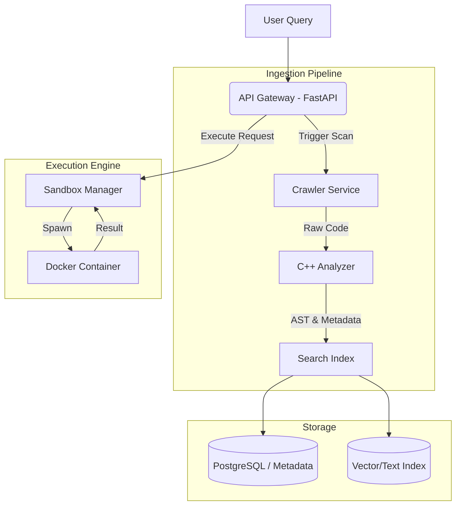
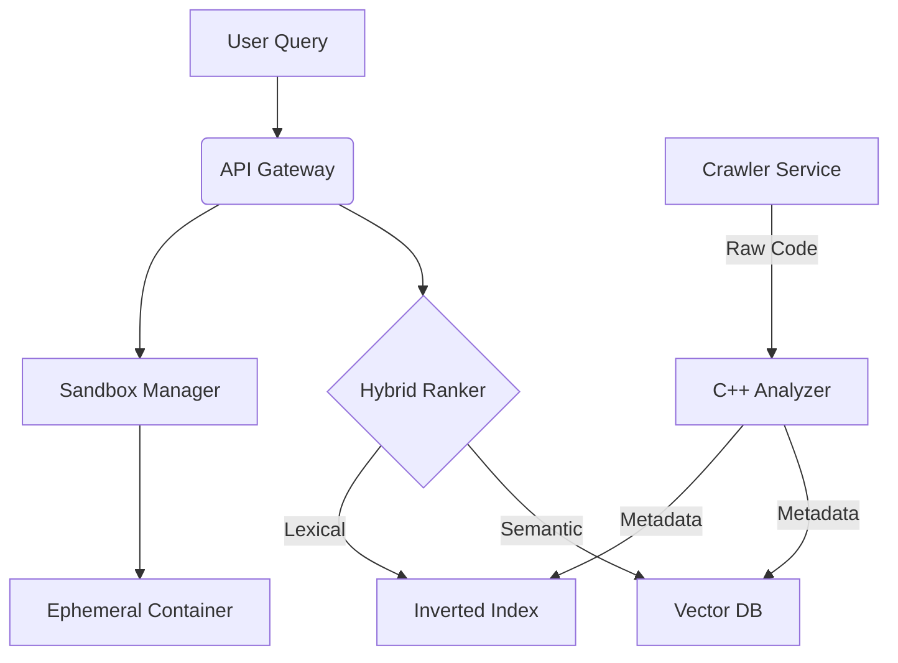

<<<<<<< HEAD

# CodeSeer 👁️

[](https://opensource.org/licenses/MIT)
[]()
[]()

> **A Modular Code Search Engine with Sandboxed Execution**

CodeSeer is a developer tool designed to bridge the gap between static code search and dynamic code verification. It allows developers to index local repositories, search for code using keyword matching (and experimental semantic search), and **execute discovered snippets** in a secure, isolated container environment.

This project serves as an exploration into **system design, compiler engineering, and sandboxing architectures**.

---

## 🚀 Key Features

### 1. Hybrid Search Architecture
* **Lexical Search:** Fast, precise symbol matching (variables, function names) using TF-IDF/Inverted Indices.
* **Semantic Discovery:** [OPTIONAL: Delete if not using ML] Experimental support for vector embeddings (CodeBERT) to find code by "intent" rather than just syntax.

### 2. Live Sandboxed Execution 🛡️
* **Instant Verification:** Users can execute search results directly from the API/UI.
* **Containerized Isolation:** Spawns ephemeral Docker containers for every execution request.
* **Stateful Feedback:** Captures `stdout`, `stderr`, and exit codes to provide immediate feedback on code behavior.

### 3. C++ Static Analysis (Optimization)
* **Performance-First:** Uses a custom C++ module (`analysis-cpp`) for heavy AST parsing and metric calculation.
* **Why C++?** Offloading CPU-bound parsing tasks to C++ prevents the Python Global Interpreter Lock (GIL) from becoming a bottleneck during indexing.

---

## 🏗️ System Architecture

CodeSeer is designed as a **modular monolith**, decoupling the ingestion pipeline from the search and execution logic for future scalability.



### Engineering Decisions

* **Monolithic vs. Microservices:** Given the current scale, a modular monolith was chosen to reduce deployment complexity and network latency, while keeping components (Crawler, Analyzer, API) distinct for potential future separation.
* **Sandbox Strategy:** Standard Docker containers are used for environment consistency.
* *Note: For a production environment, this would be upgraded to `gVisor` or `Firecracker` microVMs to prevent container-escape vulnerabilities.*


=======
# CodeSeer 👁️

[](https://opensource.org/licenses/MIT)
[]()
[]()

> **A Distributed Semantic Code Search Engine with Sandboxed Execution.**

CodeSeer goes beyond traditional text-based code search. It combines **Vector Embeddings (Semantic)** with **TF-IDF (Lexical)** to understand user intent, and features a **Sandboxed Execution Environment** that allows developers to run discovered snippets securely in isolation.

---

## Key Features

### 1. Hybrid Search Architecture
Most search engines operate on keywords (Lexical) or meaning (Semantic). CodeSeer uses a hybrid ranking algorithm:
* **Semantic Layer:** Uses Transformer-based embeddings to understand "How do I reverse a binary tree?" even without matching keywords.
* **Lexical Layer:** Uses TF-IDF for precise variable/function name matching.
* **Result:** High-precision recall that understands both syntax and intent.
    
### 2. Live Sandboxed Execution 
* **Instant Verification:** Users can execute search results directly in the browser.
* **Isolation:** Code runs in ephemeral Docker containers (sandbox architecture) to prevent host system access.
* **Stateful Output:** Captures stdout/stderr and returns execution time/memory usage.

### 3. High-Performance C++ Indexer
* Core analysis modules are written in **C++** (`analysis-cpp`) to handle heavy AST parsing and static analysis at speed, interfacing with Python via bindings.
* Optimized for low-latency indexing of large repositories.

### 4. Code Intelligence & Visualization
* Visualizes codebase relationships and dependency graphs.
* Provides syntax highlighting and complexity metrics for indexed files.
>>>>>>> 61c1bc32971240d54d37e08ec213ee0ac4d05fcf

---

## 🛠️ Tech Stack

<<<<<<< HEAD
* **Core Backend:** Python 3.9+ (FastAPI)
* **Performance Module:** C++ 17 (CMake)
* **Infrastructure:** Docker, Docker Compose
* **Data:** PostgreSQL (Metadata), [OPTIONAL] FAISS/Elasticsearch (Search)

---

## ⚡ Getting Started

### Prerequisites

* Docker & Docker Compose
* Python 3.9+
* C++ Compiler (GCC/Clang)

### Installation

1. **Clone the repository**
```bash
git clone [https://github.com/RajX-dev/CODESEER-MAIN.git](https://github.com/RajX-dev/CODESEER-MAIN.git)
cd CODESEER-MAIN

```


2. **Build the C++ Analysis Module**
```bash
cd analysis-cpp
mkdir build && cd build
cmake .. && make

```


3. **Launch Services**
```bash
cp .env.example .env
docker-compose up --build

```


4. **Verify Status**
Visit `http://localhost:8000/docs` to see the API Swagger documentation.

---

## 🔮 Roadmap (Future Work)

This project is actively evolving. The following features are designed but not fully implemented:

* **Distributed Crawling:** Moving to a Redis-backed URL frontier to support multi-node crawling.
* **Security Hardening:** Implementing `seccomp` filters and network jailing for the sandbox.
* **Advanced Ranking:** Implementing Reciprocal Rank Fusion (RRF) to better weight semantic vs. lexical results.

---

## 🤝 Contributing

Contributions are welcome! Please open an issue to discuss proposed changes or architectural improvements.

## 📄 License

This project is licensed under the MIT License.

```

```
=======
* **Core Backend:** Python (FastAPI/Flask)
* **Performance Module:** C++ (Standard 17), CMake
* **Search Engine:** Hybrid implementation (Vector DB + Inverted Index)
* **Infrastructure:** Docker, Docker Compose
* **Database:** PostgreSQL / Redis (for queuing)
* **Frontend:** React / Next.js (assumed based on standard stack)

---

## Architecture Overview



Getting Started
Prerequisites
Docker & Docker Compose

Python 3.9+

C++ Compiler (GCC/Clang)

Installation
Clone the repository

---

Bash
* **git clone [https://github.com/RajX-dev/CODESEER-MAIN.git](https://github.com/RajX-dev/CODESEER-MAIN.git)
* **cd CODESEER-MAIN
* **Build the C++ Analysis Module
---
Bash
* **cd analysis-cpp
* **mkdir build && cd build
* **cmake .. && make
* ** Services via Docker
---

Bash
* **docker-compose up --build
* **Access the Dashboard Visit http://localhost:3000 (or configured port).
>>>>>>> 61c1bc32971240d54d37e08ec213ee0ac4d05fcf
