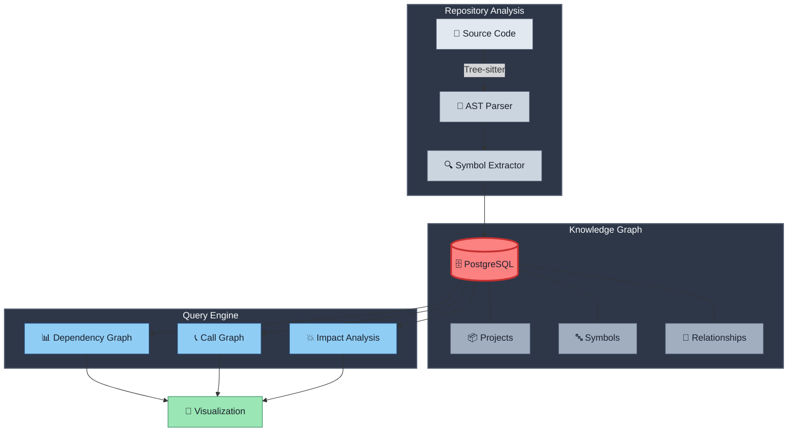
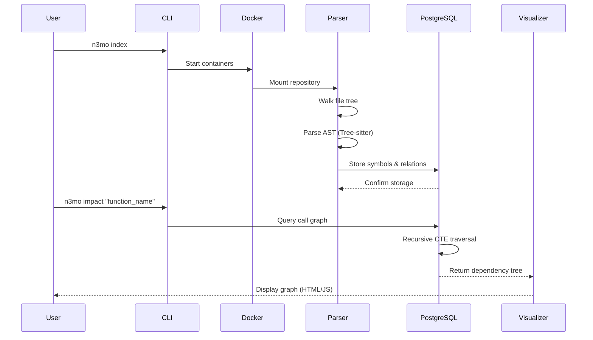
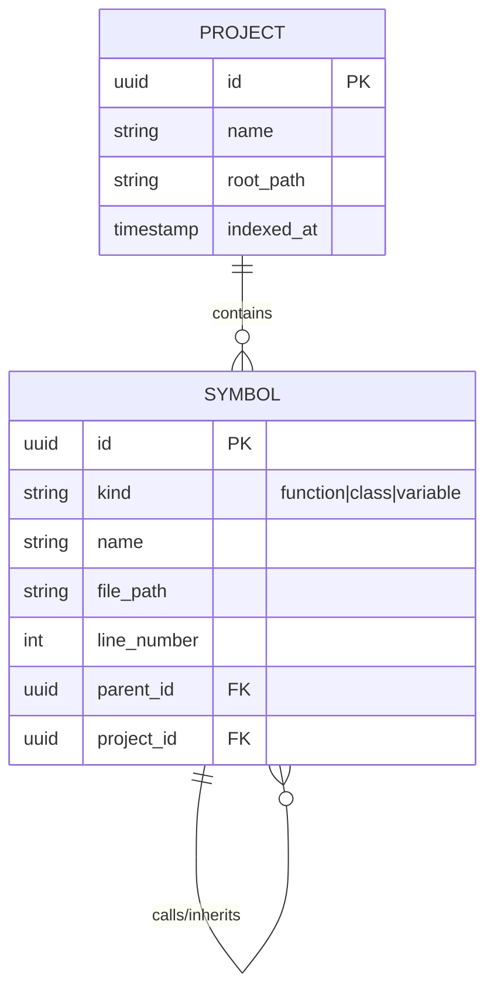
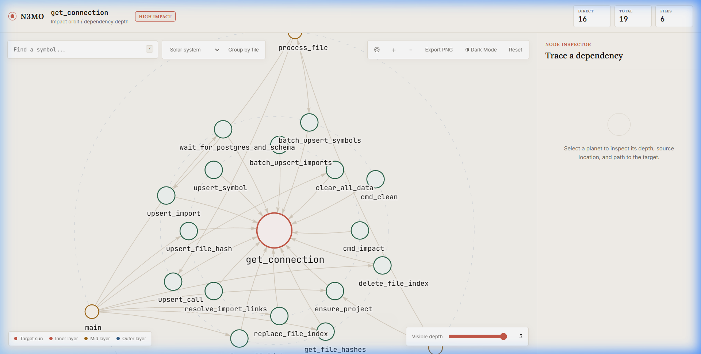
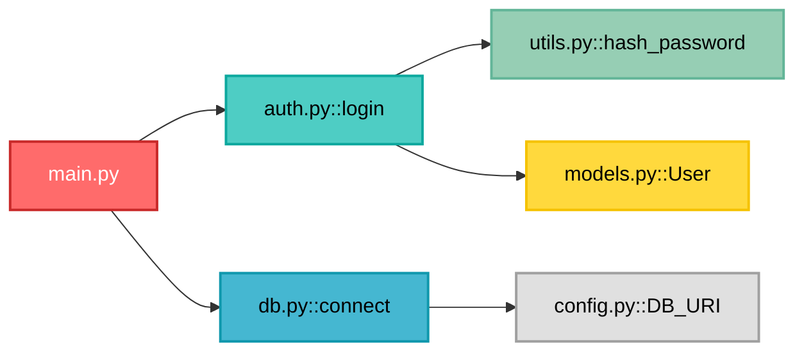

# 🔍 N3MO

<div align="center">


[](LICENSE)
[](https://www.python.org)
[](https://www.docker.com)
[]()

**A code intelligence engine that transforms repositories into queryable knowledge graphs**

*Parse once. Query forever. Know exactly what breaks before it does.*

**📜 Licensed under AGPL-3.0** — Free for personal/internal use • [Contact for commercial licensing](#-license)

[What is N3MO](#-what-is-n3mo) • [Architecture](#-architecture) • [Installation](#-installation) • [Usage](#-usage) • [Benchmarks](#-benchmarks) • [Roadmap](#-roadmap)

</div>

---

## 🎯 What is N3MO?

N3MO addresses a fundamental challenge in software engineering: **understanding large codebases**. Unlike simple code search tools that rely on text matching, N3MO models code structure first — capturing symbols, their relationships, and their call chains.

### The Problem It Solves

```
❌ Traditional grep/search:  "Where does 'login' appear?"
✅ N3MO:                     "What will break if I change the login function?"
```

**Critical questions N3MO answers:**
- 🔎 What functions and classes exist in this repository?
- 🎯 Where is this symbol being used — directly and transitively?
- 💥 What is the **blast radius** of changing this function?
- 🕸️ How do these components actually connect?

---

## 🏗️ Architecture

### Knowledge graph model

N3MO builds a **symbol-centric knowledge graph** stored in PostgreSQL:


```mermaid
graph TB
    subgraph repo["Repository Analysis"]
        A["📄 Source Code"] -->|Tree-sitter| B["🌳 AST Parser"]
        B --> C["🔍 Symbol Extractor"]
    end

    subgraph kg["Knowledge Graph"]
        D[("🗄️ PostgreSQL")]
        E["📦 Projects"]
        F["🔤 Symbols"]
        G["🔗 Relationships"]
        D --- E
        D --- F
        D --- G
    end

    subgraph query["Query Engine"]
        H["📊 Dependency Graph"]
        I["📞 Call Graph"]
        J["💥 Impact Analysis"]
    end

    C --> D
    D --> H
    D --> I
    D --> J
    H --> K["🎨 Visualization"]
    I --> K
    J --> K

    style repo fill:#2d3748,stroke:#4a5568,stroke-width:2px,color:#fff
    style kg fill:#2d3748,stroke:#4a5568,stroke-width:2px,color:#fff
    style query fill:#2d3748,stroke:#4a5568,stroke-width:2px,color:#fff
    style A fill:#e2e8f0,stroke:#4a5568,color:#1a202c
    style B fill:#cbd5e0,stroke:#4a5568,color:#1a202c
    style C fill:#cbd5e0,stroke:#4a5568,color:#1a202c
    style D fill:#fc8181,stroke:#c53030,color:#1a202c,stroke-width:3px
    style E fill:#a0aec0,stroke:#4a5568,color:#1a202c
    style F fill:#a0aec0,stroke:#4a5568,color:#1a202c
    style G fill:#a0aec0,stroke:#4a5568,color:#1a202c
    style H fill:#90cdf4,stroke:#2c5282,color:#1a202c
    style I fill:#90cdf4,stroke:#2c5282,color:#1a202c
    style J fill:#90cdf4,stroke:#2c5282,color:#1a202c
    style K fill:#9ae6b4,stroke:#2f855a,color:#1a202c
```

### System flow


```mermaid
sequenceDiagram
    participant User
    participant CLI
    participant Docker
    participant Parser
    participant DB as PostgreSQL
    participant Viz as Visualizer

    User->>CLI: n3mo index
    CLI->>Docker: Start containers
    Docker->>Parser: Mount repository
    Parser->>Parser: Walk file tree
    Parser->>Parser: Parse AST (Tree-sitter)
    Parser->>DB: Store symbols & relations
    DB-->>Parser: Confirm storage

    User->>CLI: n3mo impact "function_name"
    CLI->>DB: Query call graph
    DB->>DB: Recursive CTE traversal
    DB-->>Viz: Return dependency tree
    Viz-->>User: Display graph (HTML/JS)
```

### Data model


```mermaid
erDiagram
    PROJECT ||--o{ SYMBOL : contains
    SYMBOL ||--o{ SYMBOL : "calls/inherits"
    SYMBOL {
        uuid id PK
        string kind "function|class|variable"
        string name
        string file_path
        int line_number
        uuid parent_id FK
        uuid project_id FK
    }
    PROJECT {
        uuid id PK
        string name
        string root_path
        timestamp indexed_at
    }
```

---

## ✨ Features

### Current capabilities (v0.5)

- ✅ **Multi-Language Ingestion** — dynamic Tree-sitter loading with support for all 27 requested languages (including Python, JS, TS, Go, Rust, Java, C/C++, C#, Haskell, Perl, Ruby, PHP, Powershell, Groovy, Matlab, Delphi, Kotlin, Swift, Scala, etc.)
- ✅ **Parallel AST Ingestion** — multiprocessing scaling utilizing `ProcessPoolExecutor` to distribute CPU-bound parsing across cores
- ✅ **Strict & Flawless Exclusions** — case-insensitive directory filters (tests, mocks, specs, fixtures, temp) and camelCase-aware prefix/suffix filename checks to avoid false positives (e.g. allows `contest.py`)
- ✅ **No-Impact Skips & Pruning** — skips files with 0 symbols, imports, and calls to prevent db bloat and deletes database residues upon updates
- ✅ **Premium Theme & Visual Styling** — warm beige editorial layout inspired by modern minimalist web design with elegant typography (`Lora` serif and `Inter` sans-serif)
- ✅ **Dynamic Canvas Dark Mode** — toggleable dark mode that dynamically updates Vis.js canvas nodes, edges, labels, and orbit lines in real-time, persisting preference in `localStorage`
- ✅ **AST-based parsing** — Tree-sitter integration for error-tolerant source analysis
- ✅ **Symbol extraction** — functions, classes, methods with full file + line context
- ✅ **Hierarchical modeling** — Module → Class → Method parent-child relationships
- ✅ **Call graph construction** — who calls whom, captured at ingestion time
- ✅ **Blast radius analysis** — recursive CTE traversal to arbitrary depth
- ✅ **Idempotent ingestion** — re-indexing updates existing data without duplication
- ✅ **Interactive visualizer** — vis.js graph with click-to-inspect nodes, sidebar, and depth slider
- ✅ **Docker-first** — single-command infrastructure setup
- ✅ **Connection pooling** — eliminated per-symbol DB round trips
- ✅ **Batch inserts** — symbols, imports, and calls batched per file
- ✅ **SPLIT_PART query fix** — major call-resolution speedup
- ✅ **CLI flags** — `--file` and `--depth` for targeted impact analysis
- ✅ **Incremental re-index** — SHA-256 file hashing, skip unchanged files
- ✅ **Test suite** — pytest with database integration testing
- ✅ **GitHub Actions CI** — lint and test pipeline on every PR

### In development (v0.6)

- 🚧 **Scope-aware call resolution** — use imports table, eliminate false positives
- 🚧 **CTE cycle guard** — visited node tracking for deep recursion cycles

---

## 🚀 Installation

### Prerequisites


### Quick start

Once you have N3MO published or want to install it locally:

```bash
# Install the package
pip install .

# Run the automatic database and background engines setup
n3mo setup
```

Alternatively, for developers running in editable mode:
```bash
git clone https://github.com/RajX-dev/N3MO.git
cd N3MO
pip install -e .
n3mo setup
```

---

## 🤖 Model Context Protocol (MCP)

N3MO includes a Model Context Protocol (MCP) server that exposes N3MO's repository analysis and graph traversal tools to LLM agents (like Claude or Cursor).

### Automatic Claude Desktop Setup
To automatically configure N3MO in your local Claude Desktop:
```bash
# Navigate to the workspace you want Claude to analyze, then run:
n3mo mcp install
```
This registers N3MO and sets up the paths automatically. Restart Claude Desktop and you're ready!

### Cursor Setup
To use N3MO in Cursor:
1. Go to **Settings -> Models -> MCP**.
2. Click **+ Add New MCP Server**.
3. Set the configuration details:
   * **Name**: `n3mo`
   * **Type**: `command`
   * **Command**: `python -m n3mo.mcp_server`
   * **Environment Variables**: `TARGET_CODE_DIR=/absolute/path/to/your/active/workspace`
4. Click Save, and Cursor will instantly be able to index and query your workspace blast radius.

---

## 💻 Usage

### Index a repository

```bash
# Navigate to any Python repository
cd /path/to/your/project

# Run the indexer
n3mo index
```

**What gets indexed:**
- ✅ Python files (`.py`)
- ❌ Virtual environments (`venv/`, `.venv/`)
- ❌ Dependencies (`node_modules/`, `site-packages/`)
- ❌ Build artifacts (`.git/`, `__pycache__/`, `dist/`)

### Blast radius analysis

```bash
# Find everything affected by changing a function
n3mo impact "authenticate_user"

# Limit to a specific file or traversal depth
n3mo impact "authenticate_user" --file api/auth.py --depth 2

# Open an interactive visual graph in your browser (with depth slider)
n3mo impact "authenticate_user" --graph
```

### Visualizer Screenshots

#### Solar Orbit View


#### Horizontal Tree View


**Example terminal output:**

```
  ◈ IMPACT ANALYSIS
  ──────────────────────────────────────────────────────────────────
  Target:  authenticate_user
  ──────────────────────────────────────────────────────────────────

  ◉ Direct Callers  (3 symbols)

  ▸ login_endpoint             api/auth.py:12
  ▸ refresh_token              api/token.py:23
  ▸ validate_session           middleware/auth.py:89

  ◎ Ripple Effects  (5 symbols)

    ╰─▸ POST /login              routes.py:67
    ╰─▸ admin_login              admin/views.py:34
    ╰─▸ require_auth             decorators.py:12
    ╰─▸ dashboard_view           views/dashboard.py:8
    ╰─▸ settings_view            views/settings.py:22

  ──────────────────────────────────────────────────────────────────
  Total impacted: 8 references  │  depth ≤ 3
```

### Dependency graph visualization


```mermaid
graph LR
    A[main.py] --> B[auth.py::login]
    A --> C[db.py::connect]
    B --> D[utils.py::hash_password]
    B --> E[models.py::User]
    C --> F[config.py::DB_URI]

    style A fill:#ff6b6b,stroke:#c92a2a,stroke-width:2px,color:#fff
    style B fill:#4ecdc4,stroke:#0ca89e,stroke-width:2px,color:#000
    style C fill:#45b7d1,stroke:#1098ad,stroke-width:2px,color:#000
    style D fill:#96ceb4,stroke:#63b598,stroke-width:2px,color:#000
    style E fill:#ffd93d,stroke:#f5c200,stroke-width:2px,color:#000
    style F fill:#e0e0e0,stroke:#a0a0a0,stroke-width:2px,color:#000
```

---

## 🛠️ Technology stack

<div align="center">

| Component | Technology | Purpose |
|-----------|-----------|---------|
| **Parser** |  | Error-tolerant syntax analysis |
| **Database** |  | Relational graph storage + recursive CTE queries |
| **Runtime** |  | Core logic |
| **Infrastructure** |  | Containerization |
| **Visualization** |  | Interactive impact graph |

</div>

---

## 📊 Benchmarks

### ScanCode Toolkit (v0.3 baseline)

**Tested on [ScanCode Toolkit](https://github.com/nexB/scancode-toolkit)** — a real-world open source Python project with ~600k lines of code.

| Metric | v0.3 (baseline) |
|--------|---------------|
| **Repository** | nexB/scancode-toolkit |
| **Lines of code** | ~600,000 |
| **Index time** | ~3 minutes |
| **Processing mode** | Single-threaded |
| **Hardware** | Intel i5-13450HX, 24GB RAM, NVMe SSD |

### Django — full optimization history (v0.3 → v0.4)

| Version | Index time | Speedup |
|---------|-----------|---------|
| v0.3 baseline | 23 minutes | 1x |
| After SPLIT_PART fix | 11 minutes | 2x |
| After batch inserts (symbols/imports/calls) | 5 minutes | 4.6x |

```
Files:    3,021
Symbols:  ~43,000
Calls:    ~181,000
```

> ✅ Real measured results on Django, single-threaded, same hardware as above.
>
> **Total improvement: 4.6x faster than v0.3.** Multiprocessing (v0.5) will produce a further before/after comparison once implemented. No projections until the code exists.

### Running the Indexing Performance Benchmark

N3MO includes an automated performance benchmarking script to evaluate index timing improvements (comparing full indexing times against incremental re-indexing times):

```bash
python benchmarks/benchmark_indexing.py
```

---

## 🗺️ Roadmap

### Development timeline

| Phase | Component | Status |
|-------|-----------|--------|
| **Phase 1 — Foundations** | | |
| | Docker setup | ✅ Complete |
| | Database schema | ✅ Complete |
| | Tree-sitter integration | ✅ Complete |
| | Symbol + call extraction | ✅ Complete |
| | Blast radius (recursive CTE) | ✅ Complete |
| | Interactive visualizer | ✅ Complete |
| **Phase 2 — Performance** | | |
| | Connection pooling | ✅ Complete |
| | Batch DB operations (symbols/imports/calls) | ✅ Complete |
| | SPLIT_PART query fix | ✅ Complete |
| | `--file` / `--depth` CLI flags | ✅ Complete |
| | Interactive depth slider | ✅ Complete |
| **Phase 3 — Correctness & Scaling** | | |
| | Incremental re-index (file hashing) | ✅ Complete |
| | Multiprocessing (AST parsing) | ✅ Complete |
| | Scope-aware call resolution | ⏳ Planned |
| | CTE cycle guard | ⏳ Planned |
| | Full type annotations + mypy | ⏳ Planned |
| | pytest suite + CI | ✅ Complete |
| | Multi-language support | ✅ Complete |
| **Phase 4 — Distribution** | | |
| | MCP server (Cursor / Claude Code) | ✅ Complete |
| | FastAPI REST layer | ⏳ Planned |
| | Real-time git-hook indexing | ⏳ Planned |
| | pgvector semantic search | ⏳ Planned |

**Legend:** ✅ Complete &nbsp;|&nbsp; 🔵 In Progress &nbsp;|&nbsp; ⏳ Planned

<details>
<summary><b>Phase 1: Foundations</b> ✅ Complete</summary>

- [x] Docker environment (PostgreSQL)
- [x] Database schema — Projects, Symbols, Calls, Imports tables
- [x] Tree-sitter parser integration
- [x] Symbol extractor with full AST traversal
- [x] Idempotent upsert logic
- [x] Blast radius via recursive CTE
- [x] Interactive vis.js visualizer

</details>

<details>
<summary><b>Phase 2: Performance</b> ✅ Complete</summary>

- [x] `psycopg2.pool.ThreadedConnectionPool` — replace per-call connections
- [x] `execute_values()` batch inserts for symbols, imports, and calls — 1 transaction per file
- [x] SPLIT_PART query optimization for call resolution
- [x] `--file` and `--depth` CLI flags for targeted impact analysis
- [x] Interactive depth slider in visualizer

**Results:** Django (3,021 files, ~43k symbols, ~181k calls) — 23min → 5min (4.6x faster)

</details>

<details>
<summary><b>Phase 3: Correctness + Scaling</b> 🔵 In Progress</summary>

- [x] SHA-256 file hashing for incremental re-index
- [x] `ProcessPoolExecutor` for parallel AST parsing
- [ ] Scope-aware call resolution using imports table
- [ ] CTE cycle guard (visited node tracking)
- [ ] Full type annotations, `mypy --strict` clean
- [x] pytest unit + integration test suite
- [x] GitHub Actions CI pipeline
- [x] Multi-language support

</details>

<details>
<summary><b>Phase 4: Distribution</b> 🔵 In Progress</summary>

- [x] MCP server — N3MO as a tool for Cursor, Claude Code, Windsurf
- [ ] FastAPI REST layer — `GET /impact/{symbol}`, `POST /index`
- [ ] Real-time incremental indexing via git hooks
- [ ] `pgvector` semantic search — "find functions that do X"

</details>

---

## 📝 Design principles

**1. Structure before semantics**
Map the code skeleton (AST) before adding AI analysis. A correct graph is worth more than a smart but wrong one.

**2. Database as source of truth**
All state lives in PostgreSQL, eliminating in-memory complexity and enabling graph queries that application-level traversal cannot match.

**3. Correctness over speed**
The parser must handle syntax errors gracefully without corrupting the graph. A fast indexer that silently drops symbols is worse than a slow one that gets everything right.

**4. Idempotent operations**
Re-running ingestion produces identical results, enabling safe incremental updates and CI/CD integration.

---

## 🤝 Contributing

Contributions are welcome. Please follow these steps:

1. **Fork** the repository
2. **Create** a feature branch (`git checkout -b feature/amazing-feature`)
3. **Commit** your changes (`git commit -m 'Add amazing feature'`)
4. **Push** to the branch (`git push origin feature/amazing-feature`)
5. **Open** a Pull Request

### Development setup

```bash
# Install with dev dependencies
pip install -e ".[dev]"

# Lint
ruff check n3mo/

# Type check
mypy n3mo/

# Tests
pytest tests/
```

---

## 📜 License

Licensed under the **GNU Affero General Public License v3.0** (AGPL-3.0).

- ✅ Free for personal projects and internal tools
- ✅ Open source — view, modify, and distribute freely
- ⚠️ Copyleft — derivative works must also be AGPL-3.0
- ⚠️ Network use — modified versions run as a web service must share changes

For commercial deployments or proprietary modifications, contact for licensing options.

See [LICENSE](LICENSE) for full legal details.

---

## 👨‍💻 Author

**Raj Shekhar** — Delhi Technological University

[](https://github.com/RajX-dev)
[](https://linkedin.com/in/your-profile)

---

## 🙏 Acknowledgments

- **[Tree-sitter](https://tree-sitter.github.io/)** — for robust, incremental, error-tolerant parsing
- **[PostgreSQL](https://www.postgresql.org/)** — for making recursive graph queries possible without a graph database
- **[Docker](https://www.docker.com/)** — for reproducible, single-command environments
- **[vis.js](https://visjs.org/)** — for the interactive graph visualization

---

<div align="center">

**⭐ Star this repo if you find it useful!**

*Building tools for understanding code at scale.*


</div>