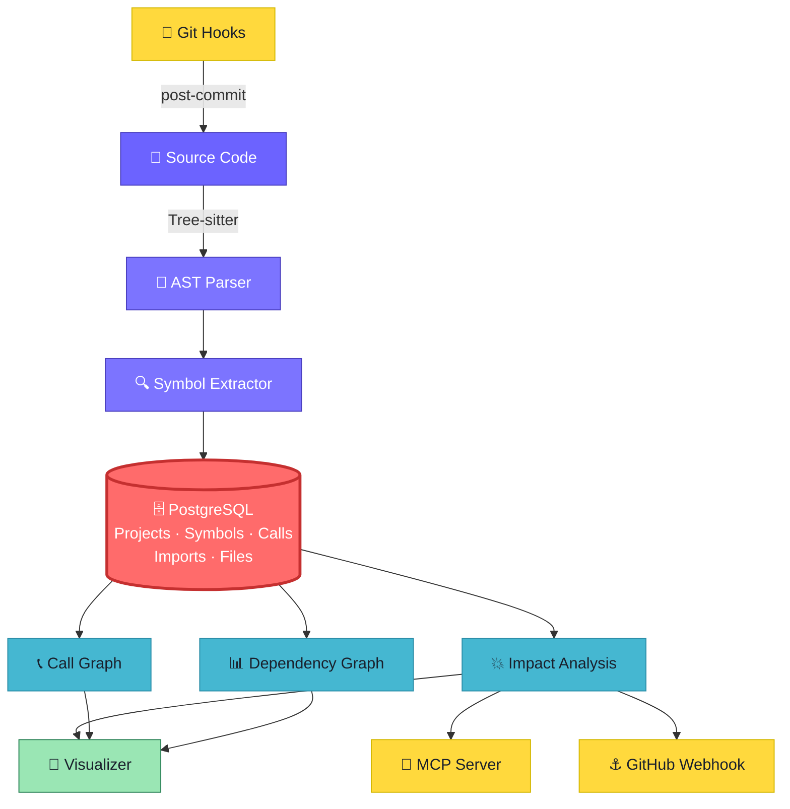
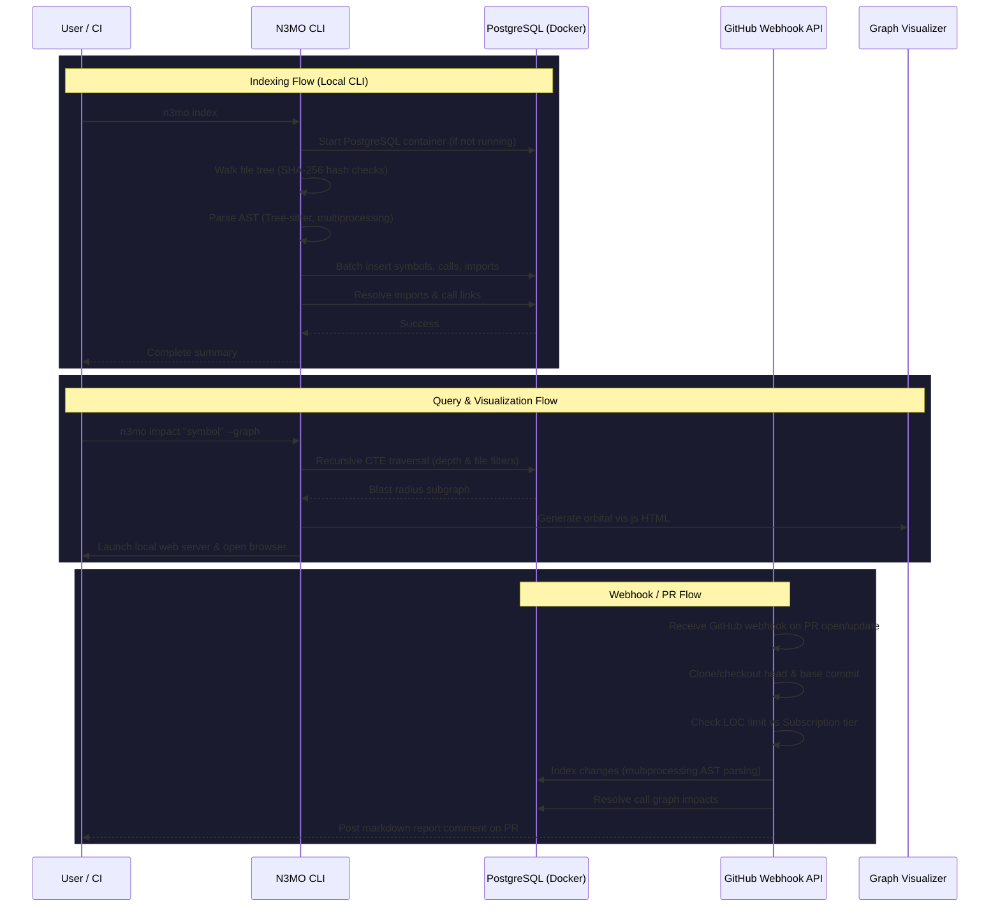
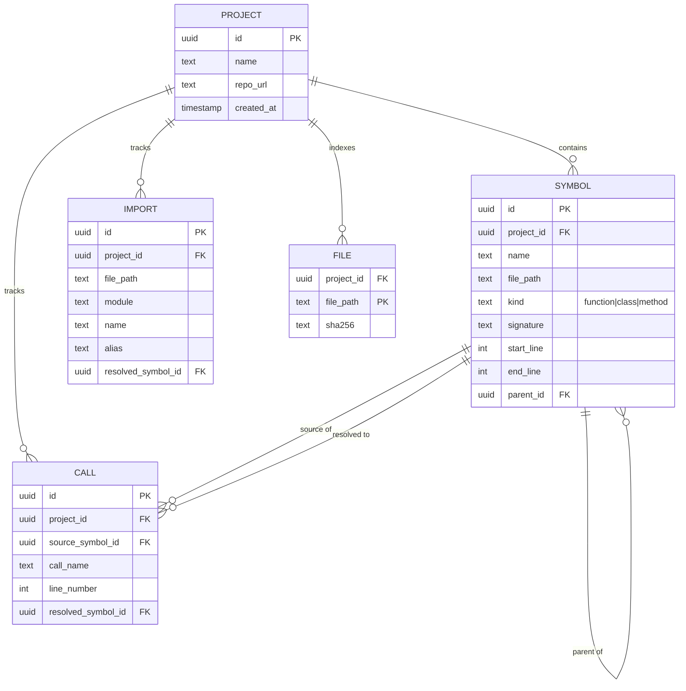
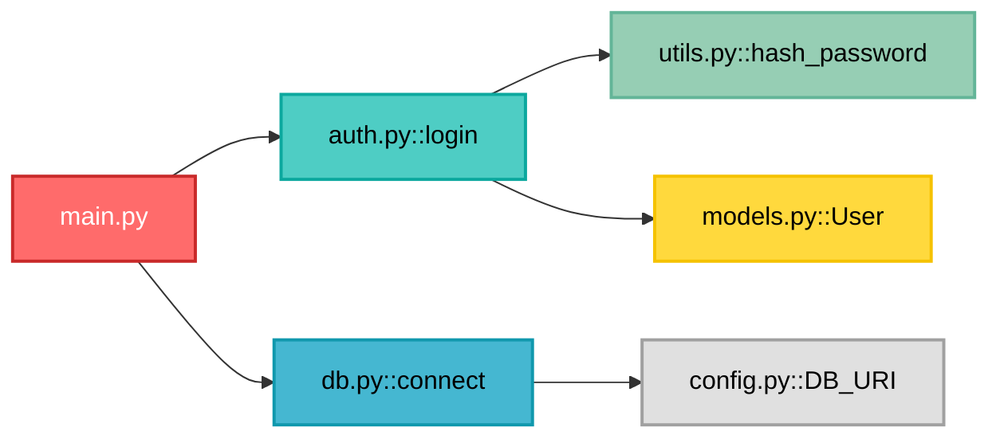

<!-- mcp-name: io.github.RajX-dev/n3mo -->
<div align="center">


<br>


[](https://pypi.org/project/n3mo/)
[](LICENSE)
[](https://www.python.org)
[](https://www.docker.com)
[]()
[![MCP Registry](https://img.shields.io/badge/MCP-Registry-purple?style=for-the-badge&logo=)](https://registry.modelcontextprotocol.io/?q=n3mo)
[](https://github.com/RajX-dev/N3MO/actions)

**A structural code intelligence engine that transforms repositories into queryable knowledge graphs.**

*Parse once. Query forever. Know exactly what breaks before it does.*

**📜 Licensed under AGPL-3.0** — Free for personal/internal use • [Contact for commercial licensing](#-license)

[What is N3MO](#-what-is-n3mo) • [Architecture](#-architecture) • [Installation](#-installation) • [GitHub App & Pricing](#-github-app-and-commercial-tiers) • [Usage](#-usage) • [Benchmarks](#-benchmarks) • [Roadmap](#-roadmap)

</div>

---

## 🎯 What is N3MO?

N3MO is a symbol-centric code intelligence engine. Instead of scanning raw text, it parses your source code's ASTs, maps call graphs, and models dependencies in a queryable relational database.

For engineering leaders and teams, N3MO acts as a **structural insurance policy** for your codebases.

### 💡 Why N3MO?

*   **🛡️ Eliminate Regression Risks:** Utility functions are rarely refactored because developers fear unknown side effects. N3MO maps the transitive blast radius of any symbol to arbitrary depth, showing you exactly what will break before you make the edit.
*   **🏎️ Rapid Developer Onboarding:** Instead of senior engineers spending hours explaining codebase flow to new hires, developers can run one command to visualize complex call chains and parent-child dependencies interactively.
*   **🤖 AI-Agent Ready Infrastructure:** Modern LLM agents (Cursor, Claude Desktop) are limited by context windows and text search. N3MO's native MCP server lets AI agents query the actual code graph, enabling fast, hallucination-free refactoring.

### 📊 How N3MO Compares

| Capability | Grep / Text Search | IDE "Find References" | N3MO Code Graph |
| :--- | :--- | :--- | :--- |
| **Analysis Basis** | Substring matching | AST-based, direct refs only | Relational knowledge graph |
| **Transitive Traversal** | ❌ None | ❌ Manual, one level at a time | ⚡ **Instant to arbitrary depth** |
| **Blast Radius Mapping** | ❌ None | ❌ Flat search-result list | 🎨 **Interactive visual orbit map** |
| **CI/CD Integration** | ❌ None | ❌ Bound to IDE runtime | ⚙️ **Dockerized CLI + CTE queries** |
| **AI Agent Integration** | ❌ Injected file chunks | ⚠️ Manual context copy | 🤖 **Native MCP server** |
| **Language Coverage** | ✅ Any text file | ⚠️ Language-specific plugins | ✅ **27 languages via Tree-sitter** |

### 🛠️ The Core Problem N3MO Solves

<table>
<tr>
<td width="50%">

**❌ Without N3MO**
<pre>
Developer: "Where does 'login' appear?"
Tool:      grep -r "login" .
Result:    647 matches across 89 files
           ...now what?
</pre>

</td>
<td width="50%">

**✅ With N3MO**
<pre>
Developer: "What breaks if I change login?"
Tool:      n3mo impact "login"
Result:    3 direct callers → 5 ripple effects
           Full blast radius in < 50ms
</pre>

</td>
</tr>
</table>

> **N3MO doesn't find text — it understands structure.** It traces the actual call graph, not string matches.

**Questions N3MO answers instantly:**

| | Question | How |
|:---:|:---|:---|
| 🔎 | What functions and classes exist in this repo? | Full symbol index across 27 languages |
| 🎯 | Where is this symbol used — directly *and* transitively? | Recursive CTE traversal to arbitrary depth |
| 💥 | What is the **blast radius** of changing this function? | Interactive orbit map with depth slider |
| 🕸️ | How do these components actually connect? | Call graph + parent-child hierarchy |
| 🤖 | Can my AI agent understand this codebase structurally? | Native MCP server for Cursor / Claude |

---

## 🏗️ Architecture

### Knowledge graph model

N3MO builds a **symbol-centric knowledge graph** stored in PostgreSQL:


```mermaid
graph TD
    A["📄 Source Code"] -->|Tree-sitter| B["🌳 AST Parser"]
    B --> C["🔍 Symbol Extractor"]
    D["🔄 Git Hooks"] -->|post-commit| A

    C --> E[("🗄️ PostgreSQL<br/>Projects · Symbols · Calls<br/>Imports · Files")]

    E --> F["💥 Impact Analysis"]
    E --> G["📞 Call Graph"]
    E --> H["📊 Dependency Graph"]

    F --> I["🎨 Visualizer"]
    G --> I
    H --> I

    F --> J["🤖 MCP Server"]
    F --> K["⚓ GitHub Webhook"]

    style A fill:#6c63ff,stroke:#4a3fbf,color:#fff
    style B fill:#7c74ff,stroke:#4a3fbf,color:#fff
    style C fill:#7c74ff,stroke:#4a3fbf,color:#fff
    style D fill:#ffd93d,stroke:#d4b800,color:#1a202c
    style E fill:#ff6b6b,stroke:#c53030,color:#fff,stroke-width:3px
    style F fill:#45b7d1,stroke:#2c8ea8,color:#1a202c
    style G fill:#45b7d1,stroke:#2c8ea8,color:#1a202c
    style H fill:#45b7d1,stroke:#2c8ea8,color:#1a202c
    style I fill:#9ae6b4,stroke:#2f855a,color:#1a202c
    style J fill:#ffd93d,stroke:#d4b800,color:#1a202c
    style K fill:#ffd93d,stroke:#d4b800,color:#1a202c
```

### System flow


```mermaid
sequenceDiagram
    participant User as User / CI
    participant CLI as N3MO CLI
    participant DB as PostgreSQL (Docker)
    participant API as GitHub Webhook API
    participant Viz as Graph Visualizer

    rect rgb(26, 27, 46)
    Note over User, DB: Indexing Flow (Local CLI)
    User->>CLI: n3mo index
    CLI->>DB: Start PostgreSQL container (if not running)
    CLI->>CLI: Walk file tree (SHA-256 hash checks)
    CLI->>CLI: Parse AST (Tree-sitter, multiprocessing)
    CLI->>DB: Batch insert symbols, calls, imports
    CLI->>DB: Resolve imports & call links
    DB-->>CLI: Success
    CLI-->>User: Complete summary
    end

    rect rgb(26, 27, 46)
    Note over User, Viz: Query & Visualization Flow
    User->>CLI: n3mo impact "symbol" --graph
    CLI->>DB: Recursive CTE traversal (depth & file filters)
    DB-->>CLI: Blast radius subgraph
    CLI->>Viz: Generate orbital vis.js HTML
    CLI->>User: Launch local web server & open browser
    end

    rect rgb(26, 27, 46)
    Note over API, DB: Webhook / PR Flow
    API->>API: Receive GitHub webhook on PR open/update
    API->>API: Clone/checkout head & base commit
    API->>API: Check LOC limit vs Subscription tier
    API->>DB: Index changes (multiprocessing AST parsing)
    API->>DB: Resolve call graph impacts
    API-->>User: Post markdown report comment on PR
    end
```

### Data model


```mermaid
erDiagram
    PROJECT ||--o{ SYMBOL : contains
    PROJECT ||--o{ CALL : tracks
    PROJECT ||--o{ IMPORT : tracks
    PROJECT ||--o{ FILE : indexes
    SYMBOL ||--o{ CALL : "source of"
    SYMBOL ||--o{ CALL : "resolved to"
    SYMBOL ||--o{ SYMBOL : "parent of"

    PROJECT {
        uuid id PK
        text name
        text repo_url
        timestamp created_at
    }
    SYMBOL {
        uuid id PK
        uuid project_id FK
        text name
        text file_path
        text kind "function|class|method"
        text signature
        int start_line
        int end_line
        uuid parent_id FK
    }
    CALL {
        uuid id PK
        uuid project_id FK
        uuid source_symbol_id FK
        text call_name
        int line_number
        uuid resolved_symbol_id FK
    }
    IMPORT {
        uuid id PK
        uuid project_id FK
        text file_path
        text module
        text name
        text alias
        uuid resolved_symbol_id FK
    }
    FILE {
        uuid project_id FK
        text file_path PK
        text sha256
    }
```

---

## ✨ Core Capabilities

### Ingestion & Parsing

- **Multi-language support** — 27 languages via dynamic Tree-sitter grammar loading (Python, JS/TS, Go, Rust, Java, C/C++, C#, Kotlin, Swift, Scala, Ruby, PHP, Haskell, Perl, and more)
- **Parallel AST ingestion** — `ProcessPoolExecutor` distributes CPU-bound parsing across all available cores
- **Incremental re-indexing** — SHA-256 file hashing skips unchanged files automatically
- **Idempotent operations** — re-indexing updates existing data without duplication
- **Smart exclusions** — case-insensitive directory filters and camelCase-aware filename checks prevent false positives (e.g. allows `contest.py` while skipping `test_*.py`)

### Analysis & Querying

- **Symbol extraction** — functions, classes, methods with full file path + line context
- **Hierarchical modeling** — parent-child relationships (Module → Class → Method)
- **Call graph construction** — who calls whom, resolved at ingestion time
- **Scope-aware resolution** — class scope > local file > imports > qualified dot paths > global
- **Blast radius analysis** — recursive CTE traversal to arbitrary depth with cycle guards

### Performance

- **Connection pooling** — `ThreadedConnectionPool` eliminates per-symbol DB round trips
- **Batch inserts** — symbols, imports, and calls batched per file in single transactions
- **Optimized queries** — `SPLIT_PART` fix delivered a 2× speedup on call resolution

### Visualization & Integration

- **Interactive graph** — vis.js orbit map with click-to-inspect nodes, sidebar, and depth slider
- **Dark mode** — toggleable canvas dark mode with real-time node/edge updates, persisted in `localStorage`
- **Premium styling** — sleek orbital interface with `Bricolage Grotesque` and `Inter` typography
- **Native MCP server** — first-class integration with Cursor, Claude Desktop, and Windsurf
- **Git hooks** — automatic re-indexing on every commit
- **CI pipeline** — GitHub Actions with linting (`ruff`), type checking (`mypy`), and `pytest`

---

## 🌐 Supported Languages

<div align="center">

| | | | |
|:---:|:---:|:---:|:---:|
|  |  |  |  |
|  |  |  |  |
|  |  |  |  |
|  |  |  |  |
|  |  |  |  |
|  |  |  |  |
|  |  |  | *…and more* |

</div>

---

## 🚀 Installation

### Prerequisites


### Quick start

Install N3MO directly from PyPI:

```bash
# Install the package
pip install n3mo

# Start Docker containers & initialize the database
n3mo setup
```

Alternatively, for contributors running in editable mode:
```bash
git clone https://github.com/RajX-dev/N3MO.git
cd N3MO
pip install -e .
n3mo setup
```

---

## 🤖 Model Context Protocol (MCP)

N3MO includes a native MCP server that exposes repository analysis and graph traversal tools to LLM agents (like Claude, Cursor, or Windsurf).

### Automatic Claude Desktop Setup
To automatically configure N3MO in your local Claude Desktop:
```bash
# Navigate to the workspace you want Claude to analyze, then run:
n3mo mcp install
```
This registers N3MO and sets up the paths automatically. Restart Claude Desktop and you're ready!

### Cursor Setup
To use N3MO in Cursor:
1. Go to **Settings -> Models -> MCP**.
2. Click **+ Add New MCP Server**.
3. Set the configuration details:
   * **Name**: `n3mo`
   * **Type**: `command`
   * **Command**: `n3mo mcp start` (or `uvx n3mo mcp start` to run directly)
   * **Environment Variables**: `TARGET_CODE_DIR=/absolute/path/to/your/active/workspace`
4. Click Save, and Cursor will instantly be able to index and query your workspace blast radius.

---

## ⚓ GitHub App and Commercial Tiers

N3MO is free for local CLI usage and single-developer MCP server integrations. For team collaboration and automated pull-request analysis, N3MO integrates as a **GitHub App webhook service** that comments impact reports directly on pull requests.

### 💰 Pricing & LOC Limits

We monetize based on the size of the repository (Lines of Code) analyzed in automated CI/CD runs:

| Tier | LOC Limit | Deployment | Description |
| :--- | :--- | :--- | :--- |
| **Free Plan** | Up to 15,000 LOC | SaaS Webhook | Ideal for open-source and small projects. |
| **Pro Plan** | Up to 100,000 LOC | SaaS Webhook | For professional teams and medium codebases. |
| **Enterprise Plan** | **Unlimited** | Self-Hosted / SaaS | Cryptographically signed offline license key (`N3MO_LICENSE_KEY`) for secure environments. |

*If a repository exceeds your tier's LOC limit, N3MO will comment on the PR prompting the team to upgrade or configure an enterprise license key.*

### ⚙️ GitHub Webhook Setup (SaaS & Self-Hosted)

Start the API server on your deployment instance, and configure the webhook payload URL on your GitHub App or repository settings to point to `http://<your-server-ip>:8000/github/webhook`.

Set the following environment variables on your server:

*   `GITHUB_TOKEN` (or `GITHUB_PAT`): A GitHub personal access token with permissions to read repository contents and post comments.
*   `GITHUB_WEBHOOK_SECRET`: Secure webhook verification token matching the GitHub App secret.
*   `N3MO_LICENSE_KEY`: Set this to your cryptographically signed JWT license key (offered to Enterprise subscribers) to unlock unlimited LOC checks.
*   *For GitHub App installations*: Configure `GITHUB_APP_ID` and `GITHUB_APP_PRIVATE_KEY` (or `GITHUB_APP_PRIVATE_KEY_PATH` / `GITHUB_PRIVATE_KEY_PATH`) along with the installation ID to automatically authenticate as an App.

---

## 💻 Usage

### Index a repository

```bash
# Navigate to any repository
cd /path/to/your/project

# Run the indexer
n3mo index
```

**What gets indexed:**
- ✅ Source files in all 27 supported languages
- ❌ Virtual environments (`venv/`, `.venv/`)
- ❌ Dependencies (`node_modules/`, `site-packages/`)
- ❌ Build artifacts (`.git/`, `__pycache__/`, `dist/`)
- ❌ Test / fixture directories (`tests/`, `mocks/`, `specs/`)

### Git Hook Integration

To automatically run incremental indexing on every commit, you can install the N3MO post-commit git hook:

```bash
# Install the post-commit hook in the current repository
n3mo git-hook install
```

### Blast radius analysis

```bash
# Find everything affected by changing a function
n3mo impact "authenticate_user"

# Limit to a specific file or traversal depth
n3mo impact "authenticate_user" --file api/auth.py --depth 2

# Open an interactive visual graph in your browser (with depth slider)
n3mo impact "authenticate_user" --graph
```

### Visualizer

#### Dark Mode — Radial Layout


#### Horizontal Tree View


**Example terminal output:**

```
  ◈ IMPACT ANALYSIS
  ──────────────────────────────────────────────────────────────────
  Target:  authenticate_user
  ──────────────────────────────────────────────────────────────────

  ◉ Direct Callers  (3 symbols)

  ▸ login_endpoint             api/auth.py:12
  ▸ refresh_token              api/token.py:23
  ▸ validate_session           middleware/auth.py:89

  ◎ Ripple Effects  (5 symbols)

    ╰─▸ POST /login              routes.py:67
    ╰─▸ admin_login              admin/views.py:34
    ╰─▸ require_auth             decorators.py:12
    ╰─▸ dashboard_view           views/dashboard.py:8
    ╰─▸ settings_view            views/settings.py:22

  ──────────────────────────────────────────────────────────────────
  Total impacted: 8 references  │  depth ≤ 3
```

### Dependency graph visualization


```mermaid
graph LR
    A[main.py] --> B[auth.py::login]
    A --> C[db.py::connect]
    B --> D[utils.py::hash_password]
    B --> E[models.py::User]
    C --> F[config.py::DB_URI]

    style A fill:#ff6b6b,stroke:#c92a2a,stroke-width:2px,color:#fff
    style B fill:#4ecdc4,stroke:#0ca89e,stroke-width:2px,color:#000
    style C fill:#45b7d1,stroke:#1098ad,stroke-width:2px,color:#000
    style D fill:#96ceb4,stroke:#63b598,stroke-width:2px,color:#000
    style E fill:#ffd93d,stroke:#f5c200,stroke-width:2px,color:#000
    style F fill:#e0e0e0,stroke:#a0a0a0,stroke-width:2px,color:#000
```

---

## 🛠️ Technology Stack

<div align="center">

| Component | Technology | Purpose |
|-----------|-----------|---------|
| **Parser** |  | Error-tolerant syntax analysis across 27 languages |
| **Database** |  | Relational graph storage + recursive CTE queries |
| **Runtime** |  | Core logic + multiprocessing |
| **Webhook API** |  | Webhook server for PR checks |
| **Infrastructure** |  | Containerization |
| **Visualization** |  | Interactive impact graph |
| **AI Integration** |  | Native tool for LLM agents |

</div>

---

## 📊 Benchmarks

All benchmarks measured on **Intel i5-13450HX, 24 GB RAM, NVMe SSD**.

### Django — Optimization History

Django is the primary benchmark target: **3,021 files**, **~43k symbols**, **~181k calls**.

```
Django Index Time (minutes)
═══════════════════════════════════════════════════════════════

v0.3 Baseline       ██████████████████████████████████████████████  23 min   1×
SPLIT_PART Fix      ██████████████████████                          11 min   2×
Batch Inserts       █████████                                        5 min   4.6×
+ Multiprocessing   ████                                           2.5 min   9× 🚀

═══════════════════════════════════════════════════════════════
```

| Optimization | Index Time | Speedup | What Changed |
|:---|:---|:---|:---|
| v0.3 baseline | 23 min | 1× | Per-symbol DB inserts, naive call resolution |
| + SPLIT_PART query fix | 11 min | 2× | Eliminated redundant string splitting in call resolution |
| + Batch inserts | 5 min | 4.6× | Symbols, imports, and calls batched per file (1 transaction) |
| + Multiprocessing | ~2.5 min | **~9×** | `ProcessPoolExecutor` distributes AST parsing across cores |

> ✅ All results are real measurements on the [Django](https://github.com/django/django) repository. Multiprocessing gains scale with core count.

### ScanCode Toolkit — Large Codebase

**Tested on [ScanCode Toolkit](https://github.com/nexB/scancode-toolkit)** — ~600k lines of Python.

| Metric | Result |
|:---|:---|
| **Lines of code** | ~600,000 |
| **Full index time** | ~3 minutes |
| **Processing mode** | Single-threaded (v0.3) |

### Incremental Re-Indexing

N3MO uses SHA-256 file hashing to skip unchanged files on subsequent runs.

| Scenario | Time | Notes |
|:---|:---|:---|
| **Full index** (first run) | Baseline | All files parsed and inserted |
| **No changes** (re-run) | **< 1 second** | Hash comparison only, zero DB writes |
| **1 file modified** | **< 2 seconds** | Only the changed file is re-parsed and upserted |

> These results are from the built-in benchmark script on a 20-file synthetic repository. Real-world incremental performance is proportional to the number of changed files, not the total repository size.

### Query Performance

Impact analysis uses PostgreSQL recursive CTEs with cycle guards. Query times are independent of repository size — they depend only on the size of the result subgraph.

| Query Type | Typical Latency |
|:---|:---|
| Direct callers of a symbol | **< 10 ms** |
| Full blast radius (depth ≤ 5) | **< 50 ms** |
| Complete graph traversal | **< 200 ms** |

### Running the Benchmark

```bash
python benchmarks/benchmark_indexing.py
```

---

## 🗺️ Roadmap

All four development phases have been completed. N3MO is stable and actively maintained.

### Development Timeline

| Phase | Component | Status |
|-------|-----------|--------|
| **Phase 1 — Foundations** | | |
| | Docker setup | ✅ Complete |
| | Database schema | ✅ Complete |
| | Tree-sitter integration | ✅ Complete |
| | Symbol + call extraction | ✅ Complete |
| | Blast radius (recursive CTE) | ✅ Complete |
| | Interactive visualizer | ✅ Complete |
| **Phase 2 — Performance** | | |
| | Connection pooling | ✅ Complete |
| | Batch DB operations (symbols/imports/calls) | ✅ Complete |
| | SPLIT_PART query optimization | ✅ Complete |
| | `--file` / `--depth` CLI flags | ✅ Complete |
| | Interactive depth slider | ✅ Complete |
| **Phase 3 — Correctness & Scaling** | | |
| | Incremental re-index (file hashing) | ✅ Complete |
| | Multiprocessing (AST parsing) | ✅ Complete |
| | Scope-aware call resolution | ✅ Complete |
| | CTE cycle guard | ✅ Complete |
| | Full type annotations + mypy | ✅ Complete |
| | pytest suite + CI | ✅ Complete |
| | Multi-language support (27 languages) | ✅ Complete |
| **Phase 4 — Distribution** | | |
| | MCP server (Cursor / Claude / Windsurf) | ✅ Complete |
| | GitHub Webhook API | ✅ Complete |
| | Real-time git-hook indexing | ✅ Complete |

<details>
<summary><b>Phase 1: Foundations</b> ✅ Complete</summary>

- [x] Docker environment (PostgreSQL)
- [x] Database schema — Projects, Symbols, Calls, Imports tables
- [x] Tree-sitter parser integration
- [x] Symbol extractor with full AST traversal
- [x] Idempotent upsert logic
- [x] Blast radius via recursive CTE
- [x] Interactive vis.js visualizer

</details>

<details>
<summary><b>Phase 2: Performance</b> ✅ Complete</summary>

- [x] `psycopg2.pool.ThreadedConnectionPool` — replace per-call connections
- [x] `execute_values()` batch inserts for symbols, imports, and calls — 1 transaction per file
- [x] SPLIT_PART query optimization for call resolution
- [x] `--file` and `--depth` CLI flags for targeted impact analysis
- [x] Interactive depth slider in visualizer

**Results:** Django (3,021 files, ~43k symbols, ~181k calls) — 23min → 5min (4.6× faster)

</details>

<details>
<summary><b>Phase 3: Correctness + Scaling</b> ✅ Complete</summary>

- [x] SHA-256 file hashing for incremental re-index
- [x] `ProcessPoolExecutor` for parallel AST parsing
- [x] Scope-aware call resolution using imports table
- [x] CTE cycle guard (visited node tracking)
- [x] Full type annotations, `mypy` clean checking in CI
- [x] pytest unit + integration test suite
- [x] GitHub Actions CI pipeline
- [x] Multi-language support (27 languages)

</details>

<details>
<summary><b>Phase 4: Distribution</b> ✅ Complete</summary>

- [x] MCP server — N3MO as a tool for Cursor, Claude Code, Windsurf
- [x] GitHub Webhook API — automated PR blast radius reports
- [x] Real-time incremental indexing via git hooks

</details>

---

## 📝 Design Principles

**1. Structure before semantics**
Map the code skeleton (AST) before adding AI analysis. A correct graph is worth more than a smart but wrong one.

**2. Database as source of truth**
All state lives in PostgreSQL, eliminating in-memory complexity and enabling graph queries that application-level traversal cannot match.

**3. Correctness over speed**
The parser must handle syntax errors gracefully without corrupting the graph. A fast indexer that silently drops symbols is worse than a slow one that gets everything right.

**4. Idempotent operations**
Re-running ingestion produces identical results, enabling safe incremental updates and CI/CD integration.

---

## 🤝 Contributing

Contributions are welcome. Please follow these steps:

1. **Fork** the repository
2. **Create** a feature branch (`git checkout -b feature/amazing-feature`)
3. **Commit** your changes (`git commit -m 'Add amazing feature'`)
4. **Push** to the branch (`git push origin feature/amazing-feature`)
5. **Open** a Pull Request

### Development Setup

```bash
# Install with dev dependencies
pip install -e ".[dev]"

# Lint
ruff check n3mo/

# Type check
mypy n3mo/

# Tests
pytest tests/
```

---

## 📜 License

Licensed under the **GNU Affero General Public License v3.0** (AGPL-3.0).

- ✅ Free for personal projects and internal tools
- ✅ Open source — view, modify, and distribute freely
- ⚠️ Copyleft — derivative works must also be AGPL-3.0
- ⚠️ Network use — modified versions run as a web service must share changes

For commercial deployments or proprietary modifications, contact for licensing options.

See [LICENSE](LICENSE) for full legal details.

---

## 👨‍💻 Author

**Raj Shekhar** — Delhi Technological University

[](https://github.com/RajX-dev)
[](https://linkedin.com/in/raj-shekhar349)

---

## 🙏 Acknowledgments

- **[Tree-sitter](https://tree-sitter.github.io/)** — for robust, incremental, error-tolerant parsing
- **[PostgreSQL](https://www.postgresql.org/)** — for making recursive graph queries possible without a graph database
- **[Docker](https://www.docker.com/)** — for reproducible, single-command environments
- **[vis.js](https://visjs.org/)** — for the interactive graph visualization
- **[FastAPI](https://fastapi.tiangolo.com/)** — for the high-performance REST layer

---

<div align="center">

**⭐ Star this repo if you find it useful! thanks for visiting**

*Building tools for understanding code at scale.*


<br><br>

<pre>
███╗   ██╗    ██████╗   ███╗   ███╗    ██████╗ 
████╗  ██║   ╚════██╗   ████╗ ████║   ██╔═══██╗
██╔██╗ ██║    █████╔╝   ██╔████╔██║   ██║   ██║
██║╚██╗██║    ╚═══██╗   ██║╚██╔╝██║   ██║   ██║
██║ ╚████║   ██████╔╝   ██║ ╚═╝ ██║   ╚██████╔╝
╚═╝  ╚═══╝    ╚═════╝   ╚═╝     ╚═╝    ╚═════╝ 
C O D E   I N T E L L I G E N C E   E N G I N E
</pre>

</div>
