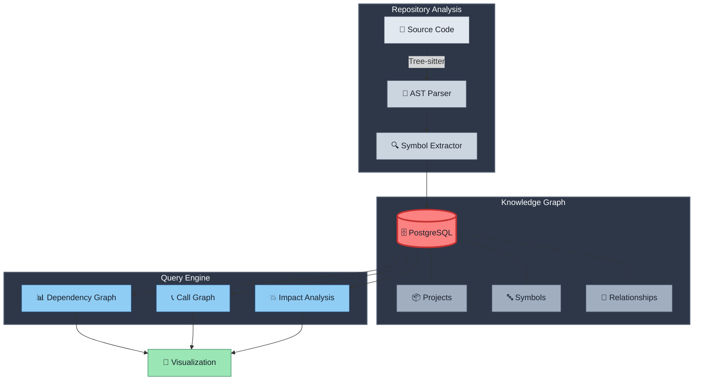
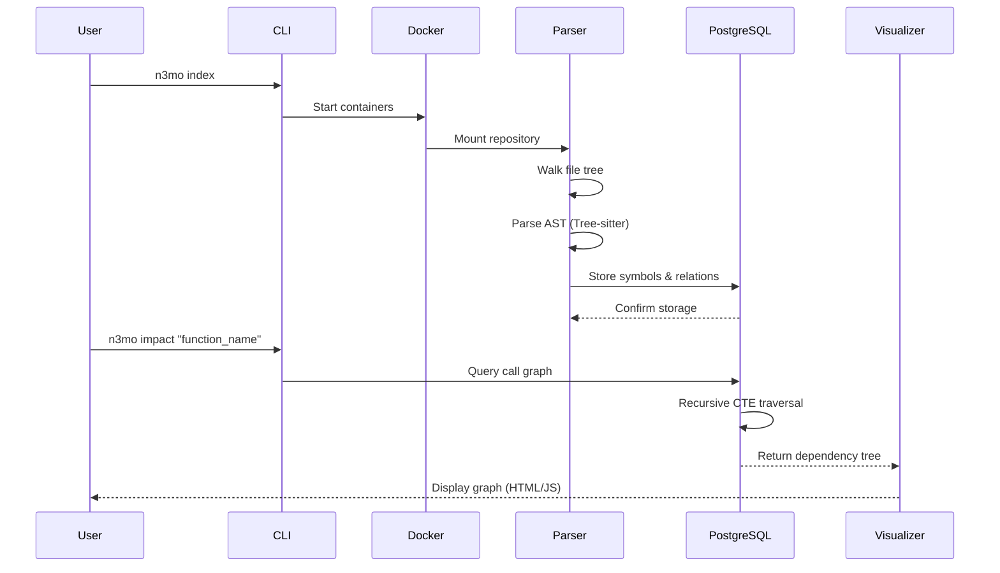

# 🔍 N3MO

<!-- mcp-name: io.github.RajX-dev/n3mo -->

<div align="center">

**A code intelligence engine that transforms repositories into queryable, AST-based knowledge graphs.**

[](https://pypi.org/project/n3mo/)
[](https://registry.modelcontextprotocol.io/?q=n3mo)
[](https://github.com/RajX-dev/N3MO/actions)
[](LICENSE)
[](https://www.python.org)
[](https://www.docker.com)

*Parse once. Query instantly. Map changes and prevent regressions at scale.*

[Key Capabilities](#-key-capabilities) • [Architecture](#-architecture) • [Installation](#-installation) • [Usage](#-usage) • [Model Context Protocol](#-model-context-protocol-mcp) • [Benchmarks](#-benchmarks)

</div>

---

## 🎯 What is N3MO?

**N3MO** is a symbol-centric code intelligence engine. Instead of relying on fragile text-based matching (like grep), N3MO parses your source code ASTs, maps complete call graphs, and models symbol relationships in a queryable relational database. 

It acts as a **structural insurance policy** for your codebases, enabling you to inspect downstream impacts before modifying a single line of code.

### 💡 Why N3MO?

*   **🛡️ Eliminate Regression Risks:** Safely refactor utilities by mapping the transitive blast radius of any symbol to arbitrary depths. Know exactly what will break before you make the edit.
*   **🏎️ Rapid Developer Onboarding:** Replace long architectural walkthroughs. Allow new developers to run a single command to visualize complex call chains and parent-child dependencies interactively.
*   **🤖 AI-Agent Ready Infrastructure:** Bypass token limits and hallucination-prone text search. N3MO's native MCP server allows LLM agents (e.g., Claude Desktop, Cursor) to query precise, AST-grounded dependency contexts directly.

### 📊 How N3MO Compares

| Capability | Grep / Text Search | IDE "Find References" | N3MO Code Graph |
| :--- | :--- | :--- | :--- |
| **Analysis Basis** | Substring Matching | AST-based Direct matching | Relational Knowledge Graph |
| **Transitive Traversal** | ❌ None | ❌ Manual (one level at a time) | ⚡ **Instant (to arbitrary depth)** |
| **Blast Radius Mapping** | ❌ None | ❌ Text-based search list | 🎨 **Interactive visual orbit map** |
| **CI/CD Integration** | ❌ None | ❌ Bound to IDE runtime | ⚙️ **Dockerized CLI & DB CTE queries** |
| **AI Agent Integration** | ❌ Injected file chunks | ⚠️ Manual context copy | 🤖 **Native MCP Server (Claude/Cursor)** |

---

## ✨ Key Capabilities

### 🔍 Parsing & Language Support
- **Multi-Language Ingestion:** Dynamic Tree-sitter loading with support for all 27+ requested languages (including Python, JS, TS, Go, Rust, Java, C/C++, C#, Haskell, Perl, Ruby, PHP, PowerShell, Groovy, MATLAB, Delphi, Kotlin, Swift, Scala, etc.).
- **AST-based Extraction:** Error-tolerant syntax analysis to extract functions, classes, methods, and variables with complete file and line number contexts.
- **Hierarchical Modeling:** Models structural relationships from parent to child (e.g., `Module` → `Class` → `Method`).

### ⚡ Performance & Scaling
- **Parallel AST Ingestion:** Harnesses multiprocessing via `ProcessPoolExecutor` to distribute heavy CPU-bound AST parsing across all available cores.
- **Batch DB Operations:** Single-transaction batch insertions (`execute_values()`) for symbols, imports, and calls to eliminate network round-trip overhead.
- **Incremental Re-indexing:** File-change detection via SHA-256 hashing to skip processing for unmodified files.
- **Optimized Graph Queries:** Custom `SPLIT_PART` lookup optimizations for lightning-fast recursive call-resolution queries.

### 🎨 Visual & CLI Tooling
- **Solar Orbit & Tree Views:** Modern visual maps built with `vis.js` featuring click-to-inspect sidebars, custom canvas layout styles, and interactive depth control.
- **Dynamic Theme Engine:** Editorial design inspired by classic print typography (`Lora` serif and `Inter` sans-serif) featuring a dynamic canvas dark mode that updates nodes, edges, labels, and orbits in real-time.
- **Granular CLI Flags:** Targeted blast radius analysis filtering using `--file` and `--depth` options.

---

## 🏗️ Architecture

### Knowledge Graph Model

N3MO constructs a symbol-centric relational knowledge graph stored in PostgreSQL:


```mermaid
graph TB
    subgraph repo["Repository Analysis"]
        A["📄 Source Code"] -->|Tree-sitter| B["🌳 AST Parser"]
        B --> C["🔍 Symbol Extractor"]
    end

    subgraph kg["Knowledge Graph"]
        D[("🗄️ PostgreSQL")]
        E["📦 Projects"]
        F["🔤 Symbols"]
        G["🔗 Relationships"]
        D --- E
        D --- F
        D --- G
    end

    subgraph query["Query Engine"]
        H["📊 Dependency Graph"]
        I["📞 Call Graph"]
        J["💥 Impact Analysis"]
    end

    C --> D
    D --> H
    D --> I
    D --> J
    H --> K["🎨 Visualization"]
    I --> K
    J --> K

    style repo fill:#2d3748,stroke:#4a5568,stroke-width:2px,color:#fff
    style kg fill:#2d3748,stroke:#4a5568,stroke-width:2px,color:#fff
    style query fill:#2d3748,stroke:#4a5568,stroke-width:2px,color:#fff
    style A fill:#e2e8f0,stroke:#4a5568,color:#1a202c
    style B fill:#cbd5e0,stroke:#4a5568,color:#1a202c
    style C fill:#cbd5e0,stroke:#4a5568,color:#1a202c
    style D fill:#fc8181,stroke:#c53030,color:#1a202c,stroke-width:3px
    style E fill:#a0aec0,stroke:#4a5568,color:#1a202c
    style F fill:#a0aec0,stroke:#4a5568,color:#1a202c
    style G fill:#a0aec0,stroke:#4a5568,color:#1a202c
    style H fill:#90cdf4,stroke:#2c5282,color:#1a202c
    style I fill:#90cdf4,stroke:#2c5282,color:#1a202c
    style J fill:#90cdf4,stroke:#2c5282,color:#1a202c
    style K fill:#9ae6b4,stroke:#2f855a,color:#1a202c
```

### System Ingestion & Analysis Flow


```mermaid
sequenceDiagram
    participant User
    participant CLI
    participant Docker
    participant Parser
    participant DB as PostgreSQL
    participant Viz as Visualizer

    User->>CLI: n3mo index
    CLI->>Docker: Start containers
    Docker->>Parser: Mount repository
    Parser->>Parser: Walk file tree
    Parser->>Parser: Parse AST (Tree-sitter)
    Parser->>DB: Store symbols & relations
    DB-->>Parser: Confirm storage

    User->>CLI: n3mo impact "function_name"
    CLI->>DB: Query call graph
    DB->>DB: Recursive CTE traversal
    DB-->>Viz: Return dependency tree
    Viz-->>User: Display graph (HTML/JS)
```

---

## 🚀 Installation

### Prerequisites
- **Docker & Docker Compose** (for database hosting)
- **Python 3.10+**
- **Git**

### Installation Steps

Install the package directly from PyPI:

```bash
# Install the package
pip install n3mo

# Start Docker containers & bootstrap database engines
n3mo setup
```

For development installations:

```bash
git clone https://github.com/RajX-dev/N3MO.git
cd N3MO
pip install -e .
n3mo setup
```

---

## 🤖 Model Context Protocol (MCP)

N3MO features a native Model Context Protocol (MCP) server that exposes codebase symbol analysis and graph queries to LLM clients.

### Claude Desktop Integration
Configure N3MO in your local Claude Desktop config automatically:
```bash
# Run within the directory you want to analyze:
n3mo mcp install
```
*Note: Restart Claude Desktop for changes to take effect.*

### Cursor Integration
To register N3MO in Cursor:
1. Open **Settings** → **Models** → **MCP**.
2. Click **+ Add New MCP Server**.
3. Apply the following settings:
   * **Name**: `n3mo`
   * **Type**: `command`
   * **Command**: `n3mo mcp start` (or `uvx n3mo mcp start`)
   * **Environment Variables**: `TARGET_CODE_DIR=/absolute/path/to/your/workspace`
4. Click Save.

---

## 💻 Usage

### 1. Ingest a Repository

Navigate to your project directory and run the indexer:
```bash
n3mo index
```
By default, N3MO runs incremental updates, analyzing newly added or modified source files and cleaning up stale database references automatically.

### 2. Run Impact Analysis

Query the blast radius of a target function or class directly from the command line:
```bash
# Traverses downstream dependencies
n3mo impact "authenticate_user"

# Restrict query limits and depths
n3mo impact "authenticate_user" --file api/auth.py --depth 2

# Open an interactive visual graph in your browser
n3mo impact "authenticate_user" --graph
```

#### CLI Output Example:
```text
  ◈ IMPACT ANALYSIS
  ──────────────────────────────────────────────────────────────────
  Target:  authenticate_user
  ──────────────────────────────────────────────────────────────────

  ◉ Direct Callers  (3 symbols)

  ▸ login_endpoint             api/auth.py:12
  ▸ refresh_token              api/token.py:23
  ▸ validate_session           middleware/auth.py:89

  ◎ Ripple Effects  (5 symbols)

    ╰─▸ POST /login              routes.py:67
    ╰─▸ admin_login              admin/views.py:34
    ╰─▸ require_auth             decorators.py:12
    ╰─▸ dashboard_view           views/dashboard.py:8
    ╰─▸ settings_view            views/settings.py:22

  ──────────────────────────────────────────────────────────────────
  Total impacted: 8 references  │  depth ≤ 3
```

#### Visualizer Screenshots

| Solar Orbit View | Horizontal Tree View |
| :---: | :---: |
|  |  |

---

## 📊 Benchmarks

### Ingestion Speeds (Django Codebase)
*Measured on a dataset of **3,021 files**, **~43,000 symbols**, and **~181,000 calls** on an Intel i5-13450HX, 24GB RAM, NVMe SSD.*

```
v0.3 Baseline (Single-thread)        ████████████████████████ 23 min
After SPLIT_PART Query Fix           ████████████ 11 min (2.0x speedup)
After Batch Ingestion Operations     █████ 5 min (4.6x speedup)
```

### Large-Scale Project Ingestion (ScanCode Toolkit)
- **Lines of Code:** ~600,000 LOC
- **Ingestion Time:** ~3 minutes (Single-threaded)

### Local Benchmark Utility
Run local ingestion benchmarks comparing full vs. incremental runs:
```bash
python benchmarks/benchmark_indexing.py
```

---

## 🗺️ Roadmap

- [x] **Phase 1: Foundations**
  - PostgreSQL database schema configurations.
  - Multi-language AST parsing using Tree-sitter.
  - Recursive CTE call graph traversal queries.
- [x] **Phase 2: Performance & Tuning**
  - Database connection pooling.
  - Bulk transaction inserts per file.
  - UI depth sliders and target filters.
- [x] **Phase 3: Scaling & Integration**
  - ProcessPoolExecutor parallel execution.
  - File signature-based incremental analysis.
  - Pytest & automated GitHub Actions CI/CD workflows.
  - Native Model Context Protocol (MCP) server implementation.
- [ ] **Phase 4: Future Enhancements**
  - Import-aware lexical scope resolution.
  - Cycle guards for recursive queries.
  - Real-time Git hook file indexing.
  - Semantic vector search via `pgvector`.

---

## 🤝 Contributing

We welcome contributions of all types. To get started:

1. Fork this repository.
2. Create a clean feature branch (`git checkout -b feature/cool-feature`).
3. Commit your changes (`git commit -m "feat: add cool feature"`).
4. Push to origin and open a Pull Request.

### Development Environment Setup:
```bash
# Install with testing and formatting dependencies
pip install -e ".[dev]"

# Code validation
ruff check n3mo/
mypy n3mo/
pytest tests/
```

---

## 📜 License & Author

Distributed under the **GNU Affero General Public License v3.0** (AGPL-3.0). See [LICENSE](LICENSE) for details. For commercial or closed-source licensing options, please contact the author.

*Designed and developed by **Raj Shekhar** (Delhi Technological University).*

[](https://github.com/RajX-dev)
[](https://linkedin.com/in/your-profile)

---

<div align="center">

**⭐ Star N3MO on GitHub if you find it helpful!**

</div>