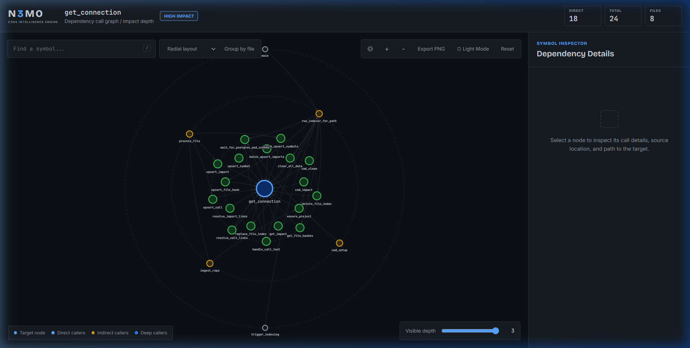
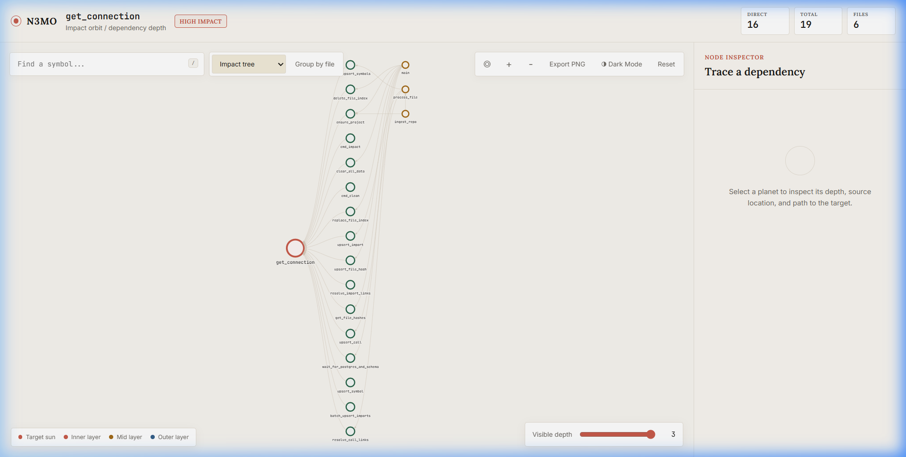
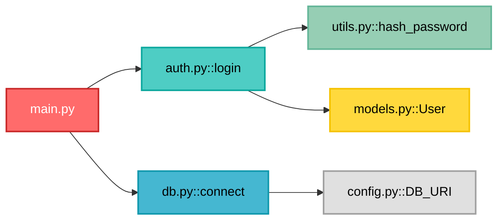

<!-- mcp-name: io.github.RajX-dev/n3mo -->
<div align="center">


<br>


[](https://n3mo.shop)
[](https://pypi.org/project/n3mo/)
[](LICENSE)
[](https://www.python.org)
[](https://www.docker.com)
[]()
[](https://registry.modelcontextprotocol.io/?q=n3mo)
[](https://github.com/RajX-dev/N3MO/actions)
[](https://pepy.tech/projects/n3mo)
[](https://discord.gg/cTgZKHf2G)


**A structural code intelligence layer that transforms source code into a queryable knowledge graph for search, impact analysis, and AI-powered development.**

*Parse once. Query forever. Know exactly what breaks before it does.*

> *"Text diffs are the source of all code review anxiety. A developer modifies a core utility, and the reviewer has to spend an hour mentally tracing downstream services to guess if it's safe to merge. N3MO replaces human guesswork with hard math."* 
> 
> **[Deploy the GitHub Webhook Instantly at n3mo.shop →](https://n3mo.shop)**

**📜 Licensed under PolyForm Noncommercial 1.0.0** — Source available for noncommercial use. • [Need commercial use? **Get a commercial license →**](https://n3mo.shop)

[What is N3MO](#-what-is-n3mo) • [Tutorial](#-tutorial) • [Benchmarks](#-benchmarks) • [Architecture](#-architecture) • [Installation](#-installation) • [MCP](#-model-context-protocol-mcp) • [Usage](#-usage) • [Roadmap](#-roadmap)

</div>


---

## 🎯 What is N3MO?

N3MO is a symbol-centric code intelligence layer. Instead of scanning raw text, it parses your source code's ASTs, maps call graphs, and models dependencies in a queryable relational database — deterministically, with **zero LLM calls at index time**.

For engineering leaders and teams, N3MO acts as a **structural insurance policy** for your codebases.

### 💡 Why N3MO?

* **🛡️ Eliminate Regression Risks** — Utility functions are rarely refactored because developers fear unknown side effects. N3MO maps the transitive blast radius of any symbol to arbitrary depth, showing you exactly what will break before you make the edit. **[Automate this in your CI/CD →](https://n3mo.shop)**
* **🏎️ Rapid Developer Onboarding** — Instead of senior engineers spending hours explaining codebase flow to new hires, developers run one command to visualize complex call chains and parent-child dependencies interactively.
* **🤖 AI-Agent Ready Infrastructure** — Modern LLM agents (Cursor, Claude Desktop) are limited by context windows and text search. N3MO's native MCP server lets agents query the actual code graph, enabling fast, hallucination-free refactoring.
* **⚡ No Embeddings, No Drift** — N3MO is pure static analysis: Tree-sitter AST parsing into PostgreSQL. There's no vector index to keep in sync, no embedding cost per repo, and no semantic-similarity guesswork — every edge in the graph is an exact, verifiable relationship.

### 📊 How N3MO Compares

| Capability | Grep / Text Search | IDE "Find References" | N3MO Code Graph |
| :--- | :--- | :--- | :--- |
| **Analysis Basis** | Substring matching | AST-based, direct refs only | Relational knowledge graph |
| **Transitive Traversal** | ❌ None | ❌ Manual, one level at a time | ⚡ **Instant to arbitrary depth** |
| **Blast Radius Mapping** | ❌ None | ❌ Flat search-result list | 🎨 **Interactive visual orbit map** |
| **CI/CD Integration** | ❌ None | ❌ Bound to IDE runtime | ⚙️ **Dockerized CLI + CTE queries** |
| **AI Agent Integration** | ❌ Injected file chunks | ⚠️ Manual context copy | 🤖 **Native MCP server** |
| **Language Coverage** | ✅ Any text file | ⚠️ Language-specific plugins | ✅ **27 Tree-sitter grammars** |
| **Indexing Method** | N/A | N/A | ✅ **Deterministic AST parse — no embeddings, no LLM calls** |

### 🛠️ The Core Problem N3MO Solves

<table>
<tr>
<td width="50%">

**❌ Without N3MO**
<pre>
Developer: "Where does 'login' appear?"
Tool:      grep -r "login" .
Result:    647 matches across 89 files
           ...now what?
</pre>

</td>
<td width="50%">

**✅ With N3MO**
<pre>
Developer: "What breaks if I change login?"
Tool:      n3mo impact "login"
Result:    3 direct callers → 5 ripple effects
           Full blast radius in < 50ms
</pre>

</td>
</tr>
</table>

> **N3MO doesn't find text — it understands structure.** It traces the actual call graph, not string matches.

**Questions N3MO answers instantly:**

| | Question | How |
|:---:|:---|:---|
| 🔎 | What functions and classes exist in this repo? | Full symbol index across 27 languages |
| 🎯 | Where is this symbol used — directly *and* transitively? | Recursive CTE traversal to arbitrary depth |
| 💥 | What is the **blast radius** of changing this function? | Interactive orbit map with depth slider |
| 🕸️ | How do these components actually connect? | Call graph + parent-child hierarchy |
| 🤖 | Can my AI agent understand this codebase structurally? | Native MCP server for Cursor / Claude |


---

---


## ✨ Core Capabilities

### Ingestion & Parsing

* **Multi-language support** — 27 Tree-sitter grammars supported (dynamically loaded); actively benchmarked on 10 major languages including Python, JS/TS, Go, Java, and C/C++
* **Parallel AST ingestion** — `ProcessPoolExecutor` distributes CPU-bound parsing across all available cores
* **Incremental re-indexing** — SHA-256 file hashing skips unchanged files automatically
* **Idempotent operations** — re-indexing updates existing data without duplication
* **Smart exclusions** — case-insensitive directory filters and camelCase-aware filename checks prevent false positives (e.g. allows `contest.py` while skipping `test_*.py`)

### Analysis & Querying

* **Symbol extraction** — functions, classes, methods with full file path + line context
* **Hierarchical modeling** — parent-child relationships (Module → Class → Method)
* **Call graph construction** — who calls whom, resolved at ingestion time
* **Scope-aware resolution** — class scope > local file > imports > qualified dot paths > global
* **Blast radius analysis** — recursive CTE traversal to arbitrary depth with cycle guards

### Performance

* **Connection pooling** — `ThreadedConnectionPool` eliminates per-symbol DB round trips
* **Batch inserts** — symbols, imports, and calls batched per file in single transactions
* **Optimized queries** — `SPLIT_PART` fix delivered a 2× speedup on call resolution

### Visualization & Integration

* **Interactive graph** — vis.js orbit map with click-to-inspect nodes, sidebar, and depth slider
* **Dark mode** — toggleable canvas dark mode with real-time node/edge updates, persisted in `localStorage`
* **Premium styling** — sleek interactive dashboard landing page UI and graph visualizer styled with `Bricolage Grotesque`, `Inter`, and `JetBrains Mono` typography
* **[SKILL.md](SKILL.md)** profile — system instructions to configure Claude as an impact-aware coding agent
* **Native MCP server** — first-class integration with Cursor, Claude Desktop, and Windsurf
* **Git hooks** — automatic re-indexing on every commit
* **CI pipeline** — GitHub Actions with linting (`ruff`), type checking (`mypy`), and `pytest`


---

---


## 🌐 Supported Languages

<div align="center">

| | | | |
|:---:|:---:|:---:|:---:|
|  |  |  |  |
|  |  |  |  |
|  |  |  |  |
|  |  |  |  |
|  |  |  |  |
|  |  |  |  |
|  |  |  | *…and more* |

</div>

> Tree-sitter parsing supported for 27 languages. Deep semantic call graph mapping currently optimized for Python, JS/TS, and Java.


---

---


## 🚀 Installation

### Prerequisites


### Quick start

Install N3MO directly from PyPI:

```bash
# Install the package
pip install n3mo

# Start Docker containers & initialize the database
n3mo setup
```

Alternatively, for contributors running in editable mode:
```bash
git clone https://github.com/RajX-dev/N3MO.git
cd N3MO
pip install -e .
n3mo setup
```


---

---


## 💻 Usage

### Index a repository

```bash
cd /path/to/your/project
n3mo index
```

**What gets indexed:**
* ✅ Source files in all 27 supported languages
* ❌ Virtual environments (`venv/`, `.venv/`)
* ❌ Dependencies (`node_modules/`, `site-packages/`)
* ❌ Build artifacts (`.git/`, `__pycache__/`, `dist/`)
* ❌ Test / fixture directories (`tests/`, `mocks/`, `specs/`)

### Visualizer

#### Dark Mode — Radial Layout


#### Horizontal Tree View


**Example terminal output:**

```
  ◈ IMPACT ANALYSIS
  ──────────────────────────────────────────────────────────────────
  Target:  authenticate_user
  ──────────────────────────────────────────────────────────────────

  ◉ Direct Callers  (3 symbols)

  ▸ login_endpoint             api/auth.py:12
  ▸ refresh_token              api/token.py:23
  ▸ validate_session           middleware/auth.py:89

  ◎ Ripple Effects  (5 symbols)

    ╰─▸ POST /login              routes.py:67
    ╰─▸ admin_login              admin/views.py:34
    ╰─▸ require_auth             decorators.py:12
    ╰─▸ dashboard_view           views/dashboard.py:8
    ╰─▸ settings_view            views/settings.py:22

  ──────────────────────────────────────────────────────────────────
  Total impacted: 8 references  │  depth ≤ 3
```

### Dependency graph visualization


```mermaid
graph LR
    A[main.py] --> B[auth.py::login]
    A --> C[db.py::connect]
    B --> D[utils.py::hash_password]
    B --> E[models.py::User]
    C --> F[config.py::DB_URI]

    style A fill:#ff6b6b,stroke:#c92a2a,stroke-width:2px,color:#fff
    style B fill:#4ecdc4,stroke:#0ca89e,stroke-width:2px,color:#000
    style C fill:#45b7d1,stroke:#1098ad,stroke-width:2px,color:#000
    style D fill:#96ceb4,stroke:#63b598,stroke-width:2px,color:#000
    style E fill:#ffd93d,stroke:#f5c200,stroke-width:2px,color:#000
    style F fill:#e0e0e0,stroke:#a0a0a0,stroke-width:2px,color:#000
```


---

---


## 🎥 Tutorial

[Watch the Tutorial Video on GitHub](https://github.com/RajX-dev/N3MO/blob/main/docs/tutorial.mp4?raw=true)


---

---


## 🤖 Model Context Protocol (MCP)

N3MO includes a native MCP server that exposes repository analysis and graph traversal tools to LLM agents (like Claude, Cursor, or Windsurf).

### Automatic Claude Desktop Setup
```bash
# Navigate to the workspace you want Claude to analyze, then run:
n3mo mcp install
```
This registers N3MO and sets up the paths automatically. Restart Claude Desktop and you're ready!

### 🧠 Claude Skill (System Instructions)
To configure Claude to run N3MO impact queries proactively before changing code in the editor, import or copy-paste the custom instructions from the **[SKILL.md](SKILL.md)** profile.

### Cursor Setup
1. Go to **Settings → Models → MCP**.
2. Click **+ Add New MCP Server**.
3. Set the configuration details:
   * **Name**: `n3mo`
   * **Type**: `command`
   * **Command**: `n3mo mcp start` (or `uvx n3mo mcp start` to run directly)
   * **Environment Variables**: `TARGET_CODE_DIR=/absolute/path/to/your/active/workspace`
4. Click Save, and Cursor will instantly be able to index and query your workspace blast radius.

### 🏢 Scale to Team Callout
*Bringing AI agents to your team workspace?* Stop forcing every developer to run heavy indexing pipelines and PostgreSQL instances on their local laptops. 

Connect Cursor directly to the global cloud graph at **[n3mo.shop](https://n3mo.shop)** to bypass local machine database overhead entirely. Your agents query the cloud graph instantly.

### 🧰 Available MCP Tools

| Tool | Description |
|:---|:---|
| `n3mo_index` | Ingests and indexes the codebase |
| `n3mo_search_symbol` | Locates the definition of a symbol across the workspace (file path, line number) |
| `n3mo_get_dependencies` | Finds all external symbols that a given symbol calls (forward-dependency graph) |
| `n3mo_get_file_symbols` | Lists all classes and functions defined inside a specific file |
| `n3mo_get_blast_radius` | Traces the transitive impact/call graph of a code symbol |


---

---


## ☁️ Enterprise CI/CD Automation (The SaaS Pivot)

Running deterministic AST parsing in a local loop is great, but manually building multi-step YAML actions, maintaining CI database infrastructure, and orchestrating PR timeline events is a massive friction point for engineering teams. 

**[n3mo.shop](https://n3mo.shop)** is our definitive, zero-maintenance infrastructure layer that abstracts all of this away. 

* **Zero-Config Webhooks:** 2-click GitHub App sync. No YAML boilerplate to maintain.
* **Automated Inline PR Comments:** N3MO hooks into your repository and posts the exact blast radius directly into your GitHub review timeline:
  
  ```markdown
  ◈ N3MO Pull Request Impact Analysis
  ⚠️ Blast Radius Detected: Modifying `core_auth.py` transitively impacts 3 downstream services.
  - `api/billing.py:process_payment()`
  - `web/handlers.py:login_route()`
  - `cron/sync_users.py:execute()`
  ```
* **Strict "Zero-Trust" Privacy:** We only parse structural AST metadata (symbol relationships). **Your raw source code is never stored on our servers.** The ephemeral parsing container is instantly destroyed the millisecond the PR comment is posted.

**[Offload your pipeline infrastructure today at n3mo.shop →](https://n3mo.shop)**


---

## 📊 Benchmarks

All benchmarks measured on **Intel i5-13450HX, 24 GB RAM, NVMe SSD**.

### Django — Optimization History

Django is the primary benchmark target: **3,021 files**, **~43K symbols**, **~181K calls**.

```
Django Index Time (minutes)
═══════════════════════════════════════════════════════════════

v0.3 Baseline       ██████████████████████████████████████████████  23 min   1×
SPLIT_PART Fix      ██████████████████████                          11 min   2×
Batch Inserts       █████████                                        5 min   4.6×
+ Multiprocessing   ████                                           2.5 min   9× 🚀

═══════════════════════════════════════════════════════════════
```

| Optimization | Index Time | Speedup | What Changed |
|:---|:---|:---|:---|
| v0.3 baseline | 23 min | 1× | Per-symbol DB inserts, naive call resolution |
| + SPLIT_PART query fix | 11 min | 2× | Eliminated redundant string splitting in call resolution |
| + Batch inserts | 5 min | 4.6× | Symbols, imports, and calls batched per file (1 transaction) |
| + Multiprocessing | ~2.5 min | **~9×** | `ProcessPoolExecutor` distributes AST parsing across cores |

> ✅ All results are real measurements on the [Django](https://github.com/django/django) repository. Multiprocessing gains scale with core count.

### TensorFlow — Enterprise-Scale Monorepo

**Tested on [TensorFlow](https://github.com/tensorflow/tensorflow)** — a 36,000-file, multi-language (C++/Python) monorepo.

| Metric | Result |
|:---|:---|
| **Repo size (total files)** | ~36,000 |
| **Files processed & indexed** | **14,611** *(after filtering tests, configs, and non-source files)* |
| **Total symbols extracted** | **79,523** |
| **Total call edges extracted** | **480,851** |
| **Full index time (cold start)** | **14.06 minutes** |
| **Peak memory (Docker container)** | **185 MB RAM** |
| **CPU utilization** | **~5%** |

> N3MO scales from a 3K-file pure-Python repo (Django) to a 36K-file multi-language enterprise monorepo (TensorFlow) — roughly a **5× larger indexing job at near-linear throughput**, without significant resource overhead. Symbol/edge-per-file and incremental (warm) re-index numbers for TensorFlow are being finalized in the full benchmark report.

### ScanCode Toolkit — Large Codebase

**Tested on [ScanCode Toolkit](https://github.com/nexB/scancode-toolkit)** — ~600K lines of Python.

| Metric | Result |
|:---|:---|
| **Lines of code** | ~600,000 |
| **Full index time** | ~3 minutes |
| **Processing mode** | Single-threaded (v0.3) |

### Incremental Re-Indexing

N3MO uses SHA-256 file hashing to skip unchanged files on subsequent runs.

| Scenario | Time | Notes |
|:---|:---|:---|
| **Full index** (first run) | Baseline | All files parsed and inserted |
| **No changes** (re-run) | **< 1 second** | Hash comparison only, zero DB writes |
| **1 file modified** | **< 2 seconds** | Only the changed file is re-parsed and upserted |

> These results are from the built-in benchmark script on a 20-file synthetic repository. Real-world incremental performance is proportional to the number of changed files, not the total repository size.

### Query Performance

Impact analysis uses PostgreSQL recursive CTEs with cycle guards. Query times are independent of repository size — they depend only on the size of the result subgraph.

| Query Type | Typical Latency |
|:---|:---|
| Direct callers of a symbol | **< 10 ms** |
| Full blast radius (depth ≤ 5) | **< 50 ms** |
| Complete graph traversal | **< 200 ms** |

### Running the Benchmark

```bash
python benchmarks/benchmark_indexing.py
```


---

---


---

## 📈 Project Status

N3MO's core architecture and distribution phases (Foundations, Performance, Correctness & Scaling, and Distribution) have been successfully completed. 
The project is currently stable, actively maintained, and ready for production use.


---

---


## 📝 Design Principles

**1. Structure before semantics**
Map the code skeleton (AST) before adding AI analysis. A correct graph is worth more than a smart but wrong one.

**2. Database as source of truth**
All state lives in PostgreSQL, eliminating in-memory complexity and enabling graph queries that application-level traversal cannot match.

**3. Correctness over speed**
The parser must handle syntax errors gracefully without corrupting the graph. A fast indexer that silently drops symbols is worse than a slow one that gets everything right.

**4. Idempotent operations**
Re-running ingestion produces identical results, enabling safe incremental updates and CI/CD integration.


---

---


## 🤝 Contributing

Contributions are welcome! Please read the **[CONTRIBUTING.md](CONTRIBUTING.md)** guide to get started with setting up the project, coding standards, and running checks locally.

### Development Setup

```bash
# Install with dev dependencies
pip install -e ".[dev]"

# Lint
ruff check n3mo/

# Type check
mypy n3mo/

# Tests
pytest tests/
```


---

---


## 📜 License & Pricing

### Pricing & Licensing

N3MO is free under the **PolyForm Noncommercial 1.0.0 License** for local usage and single-developer MCP integrations.

* **100% Free & Local** — CLI queries, local MCP integrations, and the visualizer with zero limits.
* **Commercial SaaS & Webhooks** — To use N3MO in team environments, CI/CD pipelines, and private GitHub webhooks, purchase a commercial license at [n3mo.shop](https://n3mo.shop).
* **Enterprise Licensing** — for large-scale organization deployments, custom SLAs, or zero-trust air-gapped environments, reach out for Enterprise options.


---

Licensed under the **PolyForm Noncommercial 1.0.0** License.

* ✅ Free for personal projects, academic research, and hobby tools
* ✅ Source available — view, modify, and distribute for noncommercial purposes
* ⚠️ Noncommercial — you may not use it for commercial purposes
* ⚠️ Restrictions apply on offering it as a service

For commercial deployments or proprietary modifications, contact for licensing options.

See [LICENSE](LICENSE) for full legal details.


---

---


## 👨💻 Author

**Raj Shekhar** — Delhi Technological University

[](https://github.com/RajX-dev)
[](https://linkedin.com/in/raj-shekhar349)


---

---


## 🙏 Acknowledgments

* **[Tree-sitter](https://tree-sitter.github.io/)** — for robust, incremental, error-tolerant parsing
* **[PostgreSQL](https://www.postgresql.org/)** — for making recursive graph queries possible without a graph database
* **[Docker](https://www.docker.com/)** — for reproducible, single-command environments
* **[vis.js](https://visjs.org/)** — for the interactive graph visualization
* **[FastAPI](https://fastapi.tiangolo.com/)** — for the high-performance REST layer


---

<div align="center">

**⭐ Star this repo if you find it useful — thanks for visiting!**

*Building tools for understanding code at scale.*


<br><br>

<pre>
███╗   ██╗    ██████╗   ███╗   ███╗    ██████╗ 
████╗  ██║   ╚════██╗   ████╗ ████║   ██╔═══██╗
██╔██╗ ██║    █████╔╝   ██╔████╔██║   ██║   ██║
██║╚██╗██║    ╚═══██╗   ██║╚██╔╝██║   ██║   ██║
██║ ╚████║   ██████╔╝   ██║ ╚═╝ ██║   ╚██████╔╝
╚═╝  ╚═══╝    ╚═════╝   ╚═╝     ╚═╝    ╚═════╝ 
C O D E   I N T E L L I G E N C E   L A Y E R
</pre>

</div>
