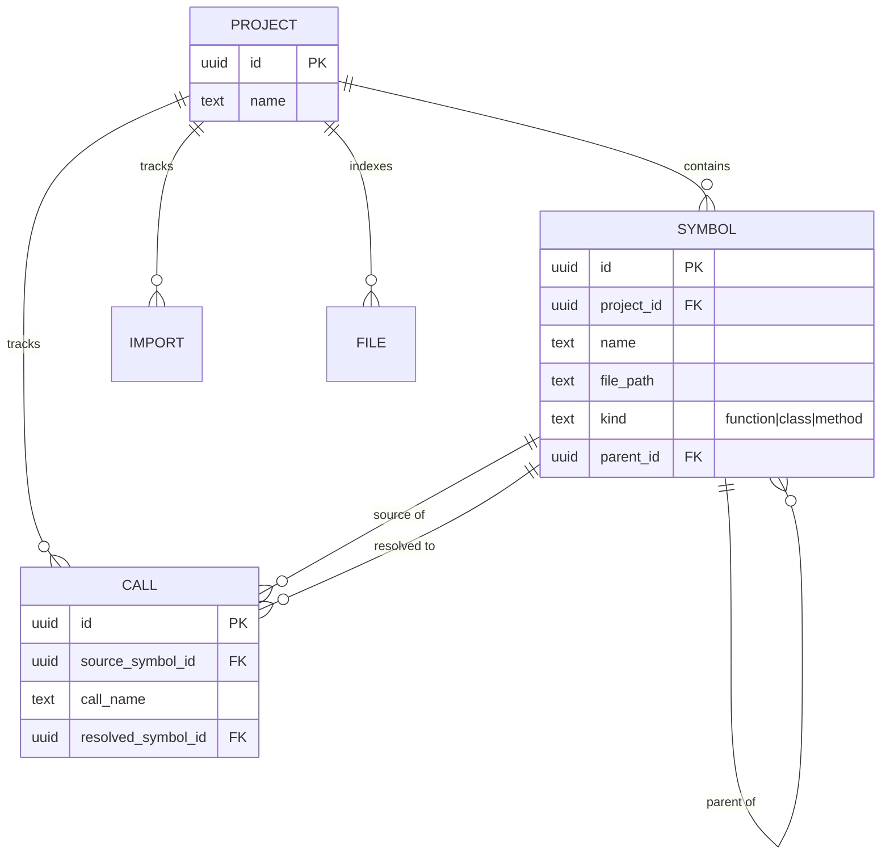
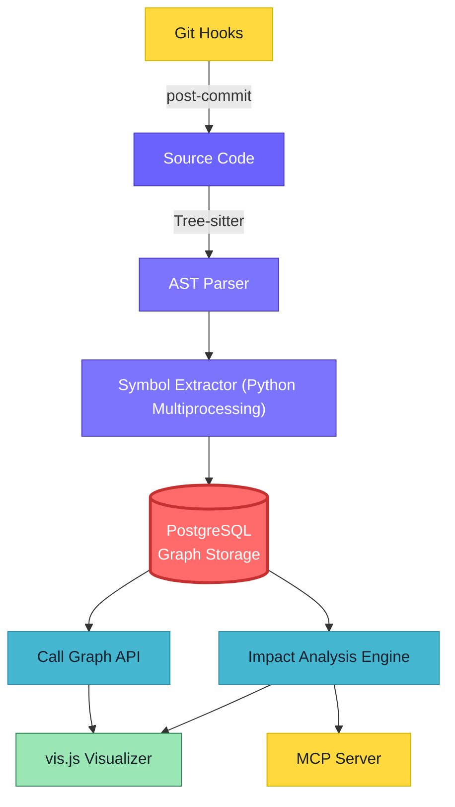
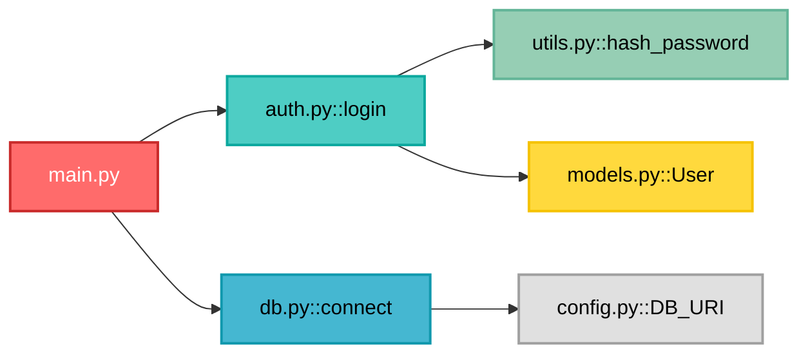

# N3MO: A Relational Knowledge Graph for Arbitrary-Depth Code Impact Analysis

## 1. Abstract

Modern software engineering relies heavily on code comprehension and the ability to safely refactor large, legacy codebases. However, developers often hesitate to modify core utility functions due to the fear of unforeseen cascading failures. Existing code search tools, such as text-based substring matching and shallow editor-bound references, are insufficient for mapping the full transitive blast radius of a code change. In this paper, we present N3MO, a structural code intelligence layer that transforms polyglot source code into a queryable relational knowledge graph. By leveraging Tree-sitter for robust Abstract Syntax Tree (AST) parsing and PostgreSQL for recursive graph traversal, N3MO maps call graphs and dependencies across 27 programming languages. N3MO performs impact analysis—resolving callers to arbitrary depths—in under 50 milliseconds, ensuring developers know exactly what will break before initiating a refactor. We evaluate N3MO’s performance on the Django repository, demonstrating its ability to index over 43,000 symbols in 2.5 minutes. The resulting graph architecture provides a robust foundation for both manual developer workflows and automated AI-agent integrations.

## 2. Introduction

### The Problem
As software repositories grow in complexity and scale, the cognitive load required to understand the codebase increases non-linearly. A common antipattern in software maintenance is the reluctance to refactor foundational code because developers cannot accurately predict the side effects. When developers attempt to understand the impact of a code change, they typically rely on file-by-file text search (e.g., `grep`) or Language Server Protocols (LSPs). Text search yields a flat list of results prone to false positives, completely lacking transitive dependency tracking. LSPs provide semantically accurate references but are generally limited to one layer of depth at a time and are tightly bound to the editor's active runtime.

### The Solution
To address these limitations, we introduce N3MO, a structural code intelligence layer that treats a codebase as a dense, queryable relational knowledge graph rather than a collection of text files. N3MO indexes code structure using ASTs and stores the resulting symbols, imports, and call graphs in a relational database. By translating the impact analysis problem into a recursive database query, N3MO instantly maps the transitive "blast radius" of any symbol to an arbitrary depth across the entire repository.

### Contributions
The main contributions of this paper are:
1. **A polyglot structural indexing architecture** utilizing Tree-sitter to parse 27 languages into a unified relational data model.
2. **A novel graph schema and scope-aware static code analysis engine** that resolves function calls and dependencies across local scopes, imports, and global namespaces.
3. **An arbitrary-depth blast radius algorithm** powered by PostgreSQL recursive Common Table Expressions (CTEs) equipped with cycle guards.

## 3. Related Work

Static analysis and code intelligence have been extensively researched, but often trade off between setup complexity, performance, and analytical depth.

- **Standard AST Analyzers & LSPs:** Standard language servers parse ASTs to provide real-time editor feedback. However, they are optimized for localized context windows and single-level reference lookups, making arbitrary-depth repository-wide traversal computationally prohibitive.
- **CodeQL (GitHub):** CodeQL treats code as data, allowing developers to write semantic queries to find vulnerabilities. While highly expressive, CodeQL requires compiling the codebase and writing complex, proprietary queries. N3MO is lighter, operates without a build step, and focuses specifically on impact topography out-of-the-box.
- **Sourcegraph / SCIP:** Sourcegraph uses the SCIP protocol to index code, designed for enterprise-scale cross-repository search. N3MO provides a more lightweight, locally-hostable alternative optimized for deep relational querying via standard SQL.
- **Kythe:** Google's Kythe defines an ecosystem for building tools that work with code. Kythe is powerful but notoriously difficult to set up, requiring deep integration with build systems. N3MO sacrifices compiler-level type checking in favor of Tree-sitter's fast, error-tolerant AST parsing, enabling analysis on broken or incomplete code.

## 4. System Architecture

N3MO is designed around a three-stage pipeline: **Ingestion**, **Resolution**, and **Traversal**. 

### Data Ingestion
N3MO uses Tree-sitter, an incremental parsing system that generates concrete syntax trees. Tree-sitter is highly error-tolerant, allowing N3MO to parse syntactically invalid code. During ingestion, N3MO executes a parallelized file walk. To minimize redundant work, N3MO hashes the contents of each file (SHA-256) and compares it against the database state, skipping unchanged files.

### Graph Schema Definition
The extracted data is stored in a relational graph, modeling the repository as nodes and edges.



- **Nodes:** Represented by `SYMBOL` (Functions, Classes, Methods) and `FILE`.
- **Edges:** Represented by `CALL` (a function invoking another) and `parent_id` foreign keys (e.g., a Method belonging to a Class).

### Service Integration
The architecture transforms raw text into a relational graph as illustrated below. The Python processing layer coordinates the multiprocessing extraction, while PostgreSQL handles the heavy relational graphing. 



## 5. Implementation Details

N3MO is implemented in Python 3.10+, utilizing the `tree-sitter` bindings for parsing and `psycopg2` for database operations. 

### Scope-Aware Resolution and Query Optimization
A fundamental challenge in static analysis is resolving a raw function call to its actual definition. N3MO performs this resolution at ingestion time rather than query time. The engine follows a strict hierarchy: Class Scope $\rightarrow$ Local File Scope $\rightarrow$ Import Scope $\rightarrow$ Global Scope. 

To achieve high-performance indexing, several optimizations were applied to the Python-PostgreSQL bridge:
1. **Threaded Connection Pooling:** Eliminated the overhead of establishing per-call database connections.
2. **Batched Transactions:** Symbol, import, and call insertions are batched per file into single database transactions using `execute_values`.
3. **Query Refactoring:** String-splitting logic (`SPLIT_PART`) in the call resolution SQL queries was heavily optimized to reduce execution time.

### Blast Radius Analysis via Recursive CTEs
Finding the transitive impact of modifying a symbol is equivalent to traversing a directed acyclic graph (DAG) in reverse. N3MO employs PostgreSQL **Recursive Common Table Expressions (CTEs)** to perform this traversal at the database engine level. 

Real-world code frequently contains recursive functions or circular dependencies. N3MO implements cycle guards directly within the SQL CTE by maintaining an array of visited nodes (`path`). If a node ID exists in the `path` array, the recursion halts for that branch, guaranteeing query termination.

Below is an example of a resolved dependency graph generated by this traversal:



## 6. Evaluation and Use Cases

### Performance Metrics
We evaluated N3MO's performance on the open-source **Django** repository, containing over 3,000 Python files, 43,000 symbols, and 181,000 call edges. Benchmarks were executed on an Intel i5-13450HX processor with 24 GB of RAM.

```text
Django Index Time (minutes)
═══════════════════════════════════════════════════════════════

v0.3 Baseline       ██████████████████████████████████████████████  23 min   1×
SPLIT_PART Fix      ██████████████████████                          11 min   2×
Batch Inserts       █████████                                        5 min   4.6×
+ Multiprocessing   ████                                           2.5 min   9× 🚀

═══════════════════════════════════════════════════════════════
```

Through batching and multiprocessing, the index time was reduced from 23 minutes to 2.5 minutes (a 9× speedup). Incremental updates leveraging file hashing take $< 2$ seconds. 

Because the code graph is heavily indexed in PostgreSQL, query latency depends solely on the size of the result subgraph. Generating a blast radius up to a depth of 5 consistently executes in $< 50$ ms.

### Practical Application
Consider a scenario where a security vulnerability is found in `utils.py::hash_password`. A standard text search reveals it is used in `auth.py::login`. However, this is insufficient to patch the system. N3MO’s recursive query instantly traces the graph: `hash_password` $\rightarrow$ `login` $\rightarrow$ `POST /api/login` $\rightarrow$ `api_gateway`. The developer immediately knows that modifying the hash function will alter the API gateway's response contract, a realization that would take hours of manual tracing otherwise.

## 7. Conclusion and Future Work

N3MO demonstrates that treating source code as a relational knowledge graph enables instantaneous, arbitrary-depth impact analysis. Its architecture—combining Tree-sitter's polyglot AST generation with PostgreSQL's recursive querying—provides a scalable and deterministic code intelligence layer that resolves the critical "fear of refactoring."

Future work will focus on expanding native language support and deepening the integration with Large Language Models (LLMs). By exposing the N3MO graph via the Model Context Protocol (MCP), LLM agents can query the repository's structural topography directly, drastically reducing hallucinations and bypassing context window limitations during automated refactoring tasks.

## 8. References

1. PostgreSQL Global Development Group. (2023). *PostgreSQL Documentation: WITH Queries (Common Table Expressions).*
2. GitHub. (2023). *Tree-sitter: An incremental parsing system for programming tools.*
3. Google. (2020). *Kythe: A pluggable codebase software tool ecosystem.*
4. Sourcegraph. (2023). *SCIP: Semantic Code Intelligence Protocol.*
5. Microsoft. (2023). *Language Server Protocol Specification.*
